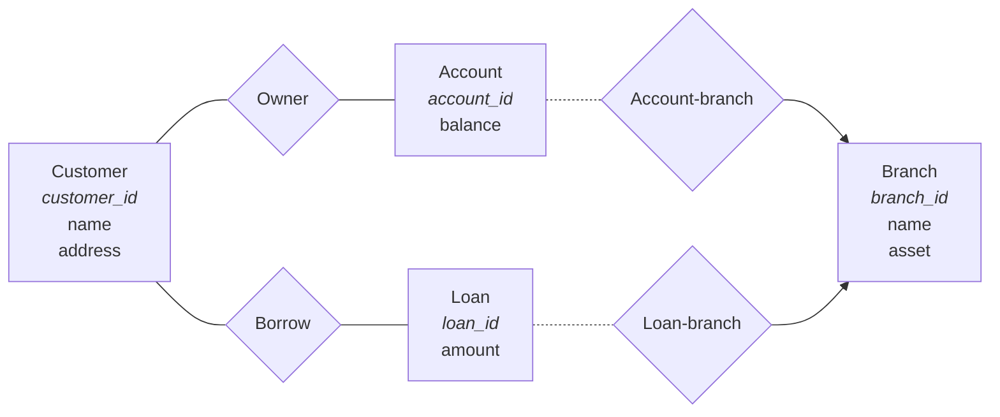

# SQL

## What is SQL?

- **_Structured Query Language_** (pronounced as "sequel").
- Language for defining, modifying and querying data in an **_RDBMS_**
  (**_relational database management system_**).
- **Declarative** language
- Has many standards and implementations
- A declarative language is a language that describes what the program should
  accomplish, rather than describing how the program should accomplish it.

### SQL Standards

- SQL-86
- SQL-89
- SQL-92
- SQL:1999
- SQL:2003
- SQL:2006
- SQL:2008
- SQL:2011
- SQL:2016
- SQL:2019

### SQL Implementations

- Oracle
- MySQL
- Microsoft SQL Server
- PostgreSQL
- SQLite
- IBM DB2
- Microsoft Access

## SQL Data Types

### Numeric Data Types

- `INT`
- `TINYINT`
- `SMALLINT`
- `MEDIUMINT`
- `BIGINT`
- `FLOAT`
- `DOUBLE`
- `DECIMAL`

### Date and Time Data Types

- `DATE`: `DATE('2014-9-18')`
- `TIME`: `TIME('12:30:00')`
- `DATETIME`: `DATE('2014-9-18 12:30:00')`
- `TIMESTAMP`
- `YEAR`

### String Data Types

- `CHAR`
- `VARCHAR`
- `TINYTEXT`
- `TEXT`
- `MEDIUMTEXT`
- `LONGTEXT`
- `BINARY`
- `VARBINARY`
- `TINYBLOB`
- `MEDIUMBLOB`
- `BLOB`
- `LONGBLOB`
- `ENUM`
- `SET`

### Other Data Types

- `BOOLEAN`
- `JSON`

### Casting

`CAST(<expression> AS <data_type>)`

```sql
SELECT required_date
FROM orders
WHERE required_date BETWEEN
  CAST('1996-07-01' AS DATE) AND
  CAST('1996-07-31' AS DATE);
```

## SQL Commands Overview

### Data Definition Language (DDL)

- `CREATE`
- `ALTER`
- `DROP`
- `TRUNCATE`
- `COMMENT`

### Data Manipulation Language (DML)

- `SELECT`
- `INSERT`
- `UPDATE`
- `DELETE`
- `MERGE`

### Data Control Language (DCL)

- `GRANT`
- `REVOKE`

### Transaction Control Language (TCL)

- `COMMIT`
- `ROLLBACK`
- `SAVEPOINT`

### Session Control

- `SET`
- `SHOW`
- `USE`

## SQL Management Commands

- `USE <database>;` selects a database.
- `SELECT database();` shows the current selected databases.
- `SHOW DATABASES;` lists all databases.
- `SHOW TABLES;` lists all tables in the current database.
- `SHOW COLUMNS FROM <table>;` or `DESC <table>;` or `DESCRIBE <table>;` shows
  the schema of a table.
- `SHOW INDEX FROM <table>;`
- `SHOW ENGINES;` shows all available storage engines.

## Engines

- `SHOW ENGINES;` shows all available storage engines.

```sql
SELECT engine, support
FROM information_schema.engines
ORDER BY engine;
```

For details about each engine, see
[MySQL Documentation](https://www.mysqltutorial.org/mysql-administration/mysql-storage-engines/).

## SQL Syntax

- SQL keywords are case-insensitive.
- SQL statements are terminated with `;`.
- SQL comments start with `--` and end with the end of the line.
- SQL statements can span multiple lines.

## Builtin Functions

Builtin functions are provided by the DBMS and can be used with `SELECT` alone.

```sql
SELECT 1 + 1;
SELECT NOW();
SELECT CONCAT('John', ' ', 'Doe');
```

You can use the dummy table `DUAL` to test builtin functions.

## Data Definition

### Example Model

We will use the following model for our examples:



### Create Table

```sql
CREATE TABLE Branch
(
  # Column definitions
  branch_id VARCHAR(15),
  name VARCHAR(30) NOT NULL,
  asset INT UNSIGNED NOT NULL,

  # Constraints
  PRIMARY KEY(branch_id)
);
```

- `<column name> <data type> <constraints>`
- `PRIMARY KEY` automatically ensures `NOT NULL`
- `PRIMARY KEY` need not be assigned on creation, can be added later.
- No comma after last column
- `NOT NULL` means must not be a null value

### Drop Table

```sql
DROP TABLE Branch;
```

- DBMS may not allow dropping a table that is referenced by another table.

### Alter Table

- `ADD` column or constraint
- `DROP` column or constraint

```sql
# Add a column
ALTER TABLE Branch ADD branch_phone INT (12);
# Remove a column
ALTER TABLE Branch DROP branch_phone;
# Add constraints
ALTER TABLE Branch ADD PRIMARY KEY (branch_id);
```

### Foreign Key Constraints

- A foreign key is a _referential constraint_ between two tables.
- The columns in the referencing table must reference the columns of the
  **primary key** or other **super key** in the referenced table.
- In MySQL5.5, the tables using the _InnoDB_ storage engine (but not _MyISAM_)
  supports foreign key constraints.
  - You can specify engine when creating table, or change engine afterwards.

```sql
# When creating table
CREATE TABLE Owner
(
  customer_id VARCHAR(15),
  account_id VARCHAR(15),
  PRIMARY KEY(customer_id, account_id),
  FOREIGN KEY(customer_id) REFERENCES Customer(customer_id),
  FOREIGN KEY(account_id) REFERENCES Account(accont_id)
) ENGINE = INNODB;

# When altering table
ALTER TABLE Owner
ADD FOREIGN KEY(customer_id) REFERENCES Customer(customer_id);

# Alter table engine
ALTER TABLE Branch ENGINE = INNODB;
```

## Data Manipulation

### Insert Clause

`INSERT INTO` inserts records (tuples) into a table.

```sql
# Specify values of 1st, 2nd and 3rd column.
INSERT INTO Branch VALUES
('B1', 'Central', 7100000),
('B2', 'Causeway Bay', 9000000);
```

### Load Data

Most DBMS provide an alternative way to insert large amount of data into a
table, e.g. `LOAD DATA LOCAL INFILE` in MySQL.

```sql
LOAD DATA LOCAL INFILE 'text.txt'
INTO TABLE Branch
FIELDS TERMINATED BY ';'
LINES TERMINATED BY '\n';
```

Content of `text.txt`:

```text
B1;Central;7100000
B2;Causeway Bay;9000000
...
```

### Delete Clause

`DELETE FROM` deletes records (tuples) from a table.

```sql
DELETE FROM Branch; # delete all records in the table
DELETE FROM Branch WHERE name = 'Central'; # only records that satisfy condition
```

### Update Clause

`UPDATE` updates records (tuples) in a table. Be careful of the order of
execution of the UPDATE statement.

```sql
UPDATE Branch
SET asset = 0
WHERE branch_id = 'B1';

# with arithmetic expressions
UPDATE Account
SET balance = balance * 1.06
WHERE balance > 500;
```

### Conditional update

```sql
UPDATE Account
SET balance = CASE
WHEN balance <= 500 THEN balance * 1.05
ELSE balance * 1.06
END;
```

## Querying

### Select Clause

`SELECT` lists the attributes desired.

```sql
SELECT name FROM Customer;
SELECT * FROM Customer; # lists all columns
SELECT loan_id, amount/7.8 FROM Loan; # multiple columns; arithmetic operations
```

### From Clause

`FROM` lists the relations (tables) involved in the query.

Listing multiple relations is equivalent to taking the _Cartesian
product_[^cartesian-product] of the relations. This is rarely what we want. We
often need to specify the conditions with the where clause.

```sql
SELECT * FROM Customer, Borrower; # Cartesian product
```

#### Subqueries in From Clause

```sql
SELECT branch_id, name
FROM
(
  SELECT branch_id, name
  FROM Branch
  WHERE asset > 10000000
  UNION
  SELECT branch_id, name
  FROM Account
  WHERE balance > 5000000
) AS T;
```

### Where Clause

`WHERE` clause specifies the conditions that the result must satisfy.

To find out the name of the borrower of each loan:

```sql
SELECT Borrower.load_id, Customer.name
FROM Customer, Borrower
WHERE Customer.customer_id = Borrower.customer_id;
```

#### Comparison Operators

- `=`, `<>`, `!=`, `>`, `<`, `>=`, `<=`

#### Logical Operators

Comparison results can be combined using logical operators: `AND`, `OR`, `NOT`.

```sql
SELECT loan_id
FROM Loan
WHERE branch_id = 'B1' AND
      amount > 1200;
```

#### Like Clause

`LIKE` is used to match a string with a _pattern_. Patterns are case sensitive.
Use single quotes `'` to enclose the pattern.

- Percent `%` matches any number of characters
- Underscore `_` matches exactly one character

```sql
SELECT name FROM Customer WHERE name LIKE 'A%';
```

#### REGEXP Clause

`REGEXP` is similar to `LIKE` but to match a string with a regular expression.

- Regex must be enclosed within **single quotes** `'`
- Case insensitive by default. Use `REGEXP BINARY` for case sensitive matching.

```sql
SELECT name FROM Customer WHERE name REGEXP BINARY '^A';
```

##### SQL Regex

| Metacharacter | Description                                      |
| ------------- | ------------------------------------------------ |
| `^`           | Beginning of string                              |
| `\|`          | Alternation (either of two alternatives)         |
| `()`          | Groups                                           |
| `-`           | Any single character (using LIKE and SIMILAR TO) |
| `%`           | Any string (using LIKE and SIMILAR TO)           |
| `.`           | Any character                                    |
| `*`           | Zero or more occurrences                         |
| `+`           | One or more occurrences                          |
| `$`           | End of line                                      |
| `?`           | Zero or one occurences                           |
| `{m}`         | Exactly m occurences                             |
| `{m,}`        | At least m occurences                            |
| `{m,n}`       | At least m and at most n occurences              |
| `[...]`       | Any character present in square brackets         |
| `[^...]`      | Any character not present inside                 |
| `[a-zA-Z0-9]` | Alphanumeric character                           |
| `[[:class:]]` | Character class                                  |

- `[[:digit:]]`, `[[:space:]]`, `[[:alnum:]]`, etc.

#### In Clause

`IN` and `NOT IN` specifies a set of values to match.

```sql
SELECT name
FROM Branch
WHERE branch_id IN ('B1', 'B2');

# Find the names of all customers who have both an account and a loan
SELECT DISTINCT customer_id
FROM Borrower
WHERE customer_id IN
      (SELECT customer_id FROM Owner);

# Find the names of all customers who have a loan but no account
SELECT DISTINCT customer_id
FROM Borrower
WHERE customer_id NOT IN
      (SELECT customer_id FROM Owner);
```

#### Exists Clause

- `EXISTS` and `NOT EXISTS` are used to check whether a subquery returns any
  tuples.
  - A _boolean set-comparison operator_

```sql
# Find the names of employees who work in department 1
SELECT E.name
FROM Employees E
WHERE EXISTS (
  SELECT *
  FROM Works_in W
  WHERE (
    E.employee_id = W.employee_id AND # depends on the row in outer query
    W.department_id = 1
  )
);
```

#### Between Clause

`BETWEEN` specifies a range of values. `NOT BETWEEN` is also available.

```sql
SELECT name
FROM Branch
WHERE asset BETWEEN 5000000 AND 10000000;
```

#### Subqueries in where clause

Sometimes using subqueries to filter beforehand is more efficient than joining
tables first.

The sub query is done for each tuple in the outer query.

```sql
SELECT DISTINCT E.employee_id, E.name
FROM Works_in W, Employee E
WHERE E.employee_id = W.employee_id AND
  W.department_id IN (
    SELECT department_id
    FROM Departments
    WHERE budget > 100000);
```

### Join Clause

`JOIN ... ON` is used to combine tuples from two relations. There are
`INNER JOIN` or `OUTER JOIN`. Default is `INNER JOIN` which generates Cartesian
product as similar to `FROM` + `WHERE`.

```sql
SELECT *
FROM Employee JOIN Department # same as INNER JOIN
ON Employee.department_id = Department.department_id;

# is equivalent to

SELECT *
FROM Employee E, Department D
WHERE E.department_id = D.department_id;
```

#### Outer join

`OUTER JOIN` doesn't require each record in the two joined tables to have a
matching record.

```sql
SELECT *
FROM Employee E LEFT OUTER JOIN
Department D
ON E.department_id = D.department_id;
```

`LEFT OUTER JOIN` returns all records from the left table (table1), and the
matched records from the right table (table2). The result is NULL from the right
side, if there is no match. Mutatis mutandis `RIGHT OUTER JOIN`.

### Distinct Results

We can use `DISTINCT` to remove duplicate results.

To find the names of all branches that have loan:

```sql
SELECT DISTINCT Branch.name
FROM Branch, Loan
WHERE Branch.branch_id = Loan.branch_id;
```

### Renaming Query Results

Rename can be done on both attributes and tables. The `AS` keyword is optional
for renaming.

```sql
# Rename attribute
SELECT DISTINCT name AS 'Branch Name'
FROM Branch, Loan
WHERE Branch.branch_id = Loan.branch_id;

# Rename table
SELECT DISTINCT B.name
FROM Branch B, Loan L
WHERE B.branch_id = L.branch_id;
```

### Order-by Clause

`ORDER BY` specifies the order in which to display the result.

- Order alphabetically for string
- `ASC` (default) for ascending order
- `DESC` for descending order
- You can specify multiple attributes to order by.

```sql
SELECT *
FROM Loan
ORDER BY branch_id ASC,
         amount DESC;
```

Since `SELECT` is evaluated before `ORDER BY`, we can use alias specified in the
`SELECT` clause in the `ORDER BY` clause.

```sql
SELECT
    orderNumber,
    orderLineNumber,
    quantityOrdered * priceEach AS subtotal
FROM
    orderdetails
ORDER BY subtotal DESC;
```

#### Field Position

You can use `FIELD()` to specify the order of the result. It returns the
position of the first argument in the subsequent arguments.

```sql
SELECT FIELD('A', 'A', 'B', 'C'); # returns 1 (1-based position)
SELECT FIELD('C', 'A', 'B', 'C'); # returns 3
SElECT FIELD('D', 'A', 'B', 'C'); # returns 0 (not found)
```

```sql
# Sort orders by status
SELECT orderNumber, status
FROM orders
ORDER BY FIELD(status,
  "In Process",
  "On Hold",
  "Cancelled",
  "Resolved",
  "Disputed",
  "Shipped"
);
```

#### Order of Null

`NULL` comes before non-null values.

### Aggregation

_Aggregate functions_ take a set of values as input and return a single value.

```sql
SELECT AVG(balance) # average
FROM Account
WHERE branch_id = 'B2';
```

#### Aggregate functions

| Function         | Description    |
| ---------------- | -------------- |
| `AVG`            | Average        |
| `MIN`            | Minimum        |
| `MAX`            | Maximum        |
| `SUM`            | Sum            |
| `COUNT`          | Count          |
| `COUNT-DISTINCT` | Count distinct |

#### Group-by Clause

`GROUP BY` let aggregate functions to be applied to groups of tuples.

```sql
# Find the average balance for each branch
SELECT Branch_id, AVG(balance)
FROM Account
GROUP BY branch_id;
```

#### Having Clause

`HAVING` specifies the conditions that must be satisfied by the result of the
`GROUP BY` clause.

```sql
SELECT branch_id, AVG(balance)
FROM Account
GROUP BY branch_id
HAVING AVG(balance) > 650;
```

### Set Operators

`UNION`, `INTERSECT` and `EXCEPT` are set operators.

```sql
SELECT branch_id
FROM Branch
WHERE asset > 10000000
UNION
SELECT branch_id
FROM Account
WHERE balance > 5000000;
```

### Nested Queries

- Subqueries usually under `WHERE` but also `FROM` and `HAVING`.
- For the ease of expressing a natural language request in SQL.
- The inner subquery could depend on the row currently examined in the outer
  query. See [Exists Clause](#exists-clause).

```sql
# Find the names of the employees in department 1
SELECT E.name
FROM Employees E, Works_in W
WHERE E.employee_id = W.employee_id AND
  W.department_id = 1;

# Same query but in more natural language:
# Find employee names whose employee_id appears in the set of employee_ids
# working for department 1.
SELECT E.name
FROM Employee E
WHERE E.employee_id IN (
  SELECT W.employee_id
  FROM Works_in W
  WHERE W.department_id = 1);
```

### Some Clause

Find department names that have greater budget than **some** department where
employee 4 works in:

```sql
NOTE: if nested query result is empty, then > SOME is false.

SELECT D.name
FROM Departments D
WHERE D.budget > SOME (
  SELECT D2.budget
  FROM Departments D2
  WHERE D2.department_id IN (
    SELECT W.department_id
    FROM Works_in W
    WHERE W.employee_id = 4
  )
);
```

### All Clause

Find department names that have greater budget than **all** departments where
employee 4 works in:

```sql
NOTE: if nested query result is empty, then > ALL is true.

SELECT D.name
FROM Departments D
WHERE D.budget > ALL (
  SELECT D2.budget
  FROM Departments D2
  WHERE D2.department_id IN (
    SELECT W.department_id
    FROM Works_in W
    WHERE W.employee_id = 4
  )
);
```

### Query Examples

#### Find the name and budget of the department with the highest budget

```sql
SELECT D2.name, D2.budget
FROM Department D2
WHERE D2.budget = (SELECT MAX(D1.budget) FROM Department D1);
```

#### Find the names of employees who work in at least 2 departments

```sql
SELECT E.name
FROM Employee E
WHERE 2 <= (
  SELECT COUNT(W.department_id)
  FROM Works_in W
  WHERE E.employee_id = W.employee_id
)
```

#### In each department, find the highest salary of employee

```sql
SELECT MAX(E.salary), W.department_id
FROM Employee E, Works_in W
GROUP BY W.department_id
HAVING E.employee_id = W.employee_id;
```

#### Find the names of employees who work in department 1 or 3

```sql
SELECT E.name
FROM Works_in W, Employees E
WHERE W.department_id IN (1, 3) AND
  E.emplyee_id = W.employee_id;
```

#### Find department names that have the greatest budget than all departments

```sql
SELECT D.name
FROM Departments D
WHERE D.budget >= ALL (
  SELECT D2.budget
  FROM Department D2
);
```

```sql
SELECT D.name
FROM Departments D
WHERE D.budget = (
  SELECT MAX(D2.budget)
  FROM Departments D2
);
```

## Null and Unknwon Values

### Null Values

- Represents **unknown** value or that value **doesn't exist**.
- Predicate `IS NULL` or `IS NOT NULL` is used to test for null value.
- Result of any _arithmetic_ operation with a null value is null.
- Any _comparison_ with null returns `UNKNOWN`

### Unknown Values

- Predicate `IS UNKNOWN` or `IS NOT UNKNOWN` is used to test for unknown value.
- For the result of `WHERE` or `HAVING` clause, predicate is false if it
  evaluates to `UNKNOWN`
- With `UNKNOWN`, we have **_three-valued logic_**. They work as you expect:
  - T OR Un = T
  - Un AND Un = Un
  - F AND Un = F
  - NOT Un = Un

### Null and Aggregate Functions

All aggregate operations except `COUNT(*)` ignore tuples with null values on the
**aggregated attributes**.

| department_id | name  | budget |
| ------------- | ----- | ------ |
| 1             | Toys  |        |
| 2             | Tools |        |
| 3             | Food  | 100000 |

- `SUM(budget)` returns 100000
- `COUNT(*)` returns 3
- `COUNT(budget)` returns 1
- `AVG(budget)` returns 100000 (I haven't tested this yet)

## Views

### What is a View?

- A view is a **virtual table** derived from other tables.
- A view is defined by a query and has no physical existence.
- Can be used like a table in queries.
- Can be used to hide complexity of a query.
- Can be used to restrict access to the data.
- Can be used to present data in a different way.

### Create-view Clause

`CREATE VIEW <view-name> AS <expression>` creates a view.

```sql
CREATE VIEW Employee_hide_salary AS (
  SELECT employee_id, name
  FROM Employees
);

CREATE VIEW Dpt_size(name, num_of_employee) AS (
  SELECT D.name, COUNT(*)
  FROM Departments D, Works_in W
  WHERE D.department_id = W.department_id
  GROUP BY W.department_id
);
```

## Authorization

### Grant Privileges

`GRANT <privilege list> ON <table/view> TO <user/role list>`

```sql
GRANT SELECT ON Departments TO Johnson, Brown;
GRANT UPDATE(budget) ON Departments TO Johnson;
GRANT UPDATE(budget) ON Departments TO manager;
```

### Revoke Privileges

`REVOKE <privilege list> ON <table/view> FROM <user/role list>`

```sql
REVOKE SELECT ON Departments FROM Johnson, Brown;
```

### Create Roles

```sql
CREATE ROLE manager;
```

### Grant Roles

```sql
GRANT manager TO Brown;
```

## Assertions

### What is an Assertion?

- An **_assertion_** is a predicate that must be true for all instances of the
  database, ensuring that certain conditions always hold.
- An assertion is defined as part of the schema.
- An assertion is checked whenever the involved tables are updated.
  - An assertion is checked after each SQL statement and the update is rejected
    if the assertion is violated.
  - So it can be very expensive.

### Create-assertion Clause

```sql
CREATE ASSERTION EmpsNoLessThanDepts
CHECK (
  (SELECT COUNT(*) FROM Departments) <= (SELECT COUNT(*) FROM Employees)
);
```

## Triggers

### What is a Trigger?

- A **_trigger_** is a statement that the system executes automatically as a
  side effect of a modification to the database.
- A trigger is defined as part of the schema.
- A trigger is executed whenever the database is updated.
- A trigger can be used to enforce integrity constraints that cannot be checked
  using assertions.
- A trigger can be used to maintain derived data.

### Create-trigger Clause

`CREATE TRIGGER <trigger-name> <trigger-time> <trigger-event> ON <table-name> FOR EACH ROW <triggered-sql-statement>`

- `<trigger-time>` can be `BEFORE` or `AFTER`
- `<trigger-event>` can be `INSERT`, `UPDATE` or `DELETE`

```sql
CREATE TRIGGER Update_balance AFTER UPDATE ON Account
FOR EACH ROW
UPDATE Branch
SET asset = asset - OLD.balance + NEW.balance
WHERE branch_id = NEW.branch_id;
```

## Transactions

### What is a Transaction?

- A **_transaction_** is a sequence of operations that is executed as a single
  unit of work.
- A transaction is a collection of operations that performs a single logical
  function in a database application.
- A transaction must obey the [**_ACID Properties_**](#acid-properties)

### ACID Properties

- **_Atomicity_**: All or nothing
- **_Consistency_**: Database must be consistent before and after the
  transaction.
- **_Isolation_**: Intermediate state of a transaction must be invisible to
  other transactions.
- **_Durability_**: Effects of a committed transaction must persist.

### Transaction Commands

- `BEGIN` starts a transaction.
- `COMMIT` ends a transaction and makes all changes permanent.
- `ROLLBACK` ends a transaction and undoes all changes.
- `SAVEPOINT` sets a savepoint within a transaction.
- `RELEASE SAVEPOINT` removes a savepoint.
- `ROLLBACK TO SAVEPOINT` rolls back to a savepoint.

### Transaction Example

```sql
BEGIN;
UPDATE Account
SET balance = balance + 100
WHERE account_id = 'A1';
COMMIT;
```

## Recursive Queries

### What is a Recursive Query?

- A recursive query is a query that refers to the same relation that is being
  queried.
- A recursive query must have a _base case_ and a _recursive case_.
- A recursive query may have a _termination condition_.

### Recursive Query Example

Find all the accounts that have a balance higher than the average balance of all
accounts at the same branch.

```sql
WITH RECURSIVE
  Average_balance(branch_id, average) AS (
    SELECT branch_id, AVG(balance) AS average
    FROM Account
    GROUP BY branch_id
  ),
  Account_with_higher_balance(branch_id, account_id, balance) AS (
    SELECT branch_id, account_id, balance
    FROM Account
    WHERE balance > (
      SELECT average
      FROM Average_balance
      WHERE Average_balance.branch_id = Account.branch_id
    )
  )
SELECT *
FROM Account_with_higher_balance;
```

### Recursive Queries with Termination Condition

Find the names of all employees who manage other employees.

```sql
WITH RECURSIVE
  Manager(employee_id) AS (
    SELECT employee_id
    FROM Employees
    WHERE employee_id IN (
      SELECT DISTINCT manager_id
      FROM Employees
    )
  ),
  Manager_with_name(employee_id, name) AS (
    SELECT employee_id, name
    FROM Employees
    WHERE employee_id IN (SELECT * FROM Manager)
  ),
  Manager_with_subordinates(employee_id, name) AS (
    SELECT *
    FROM Manager_with_name
    UNION
    SELECT E.employee_id, E.name
    FROM Manager_with_name M, Employees E
    WHERE E.manager_id = M.employee_id
  )
```

## Inner Workings

- When executing `SELECT` statment, MySQL evaluates `FROM` before `SELECT`
  clause.

## Random Commands

- `SELECT version();`
- `SELECT current_date;`
- `SELECT 2 + 2;`

## Other Topics

- Join Types: Full outer join, Inner join, Cross join
- `TRIGGER`
- **Transaction controls**
- Derived relations and the `WITH` clause
- Set operations: `UNIQUE`
- More on foreign key constraints: `ON DELETE CASCADE`, `ON UPDATE CASCADE`
- More on DCL (Data Control Language) `WITH GRANT OPTION`

## References and Links

- [MySQL Tutorial](https://www.mysqltutorial.org/)

## 🧭 Navigation

- [🔖 Parent index](../../index.md)
- [📑 Notes Index](../../index.md)

---

## Footnotes

[^cartesian-product]:
    Cartesian product is defined as
    $A \times B = \{(a, b) \mid a \in A, b \in B\}$.
