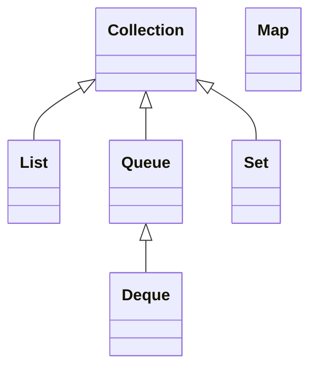
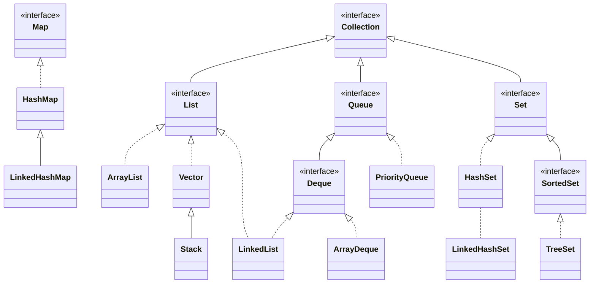
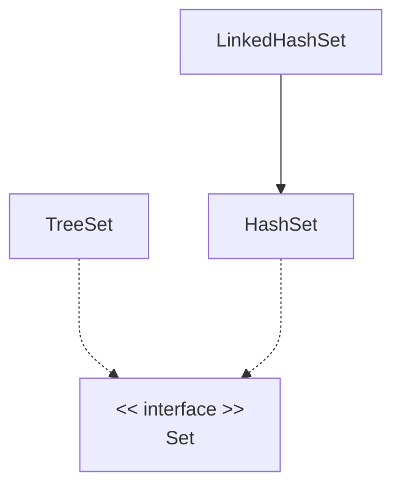
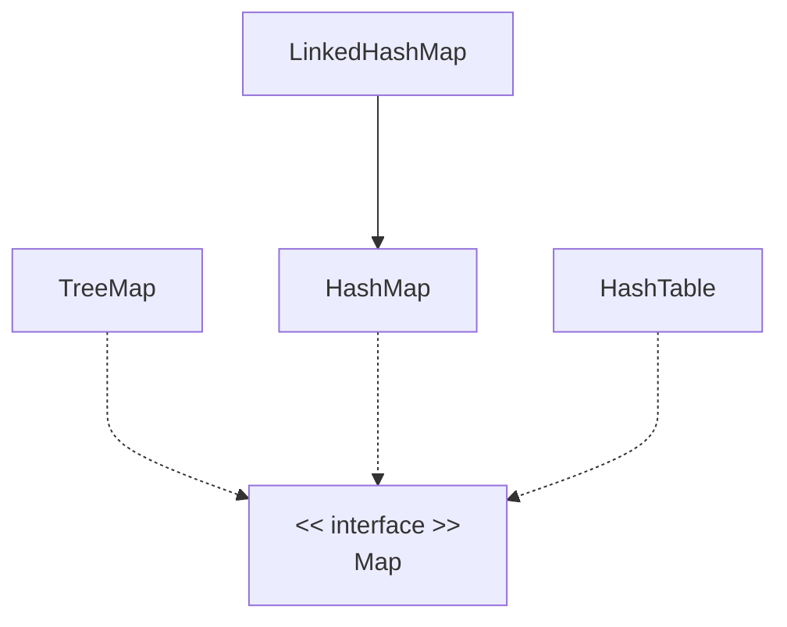

# Collections

## Basic Concepts

### Basic Collections

Lists have:

- Elements
- Position
- Order

Maps have:

- Key
- Value
- Entry - the key-value pair

### Data Structures

Data structure is to store, organize, manage, and retrieve data.

- Store: add, sometimes to a particular position
- Organize: according to internal structure, usually to optimize for certain
  operations
- Manage: remove, replace, sort
- Retrieve: Random access with a position or a key; or iterate; or search

## Collection Frameworks in Java

### Three Sections

- Interfaces - defines methods
- Implementations - concrete classes we can use
- Algorithms - static methods that work with collections

### History

The Collection Frameworks was introduced in Java 1.2. Before that, there are
classes like Vectors and Hashtables.

### Interfaces

| Interfaces | Classes           |
| ---------- | ----------------- |
| List       | ArrayList, Vector |
| Set        | HashSet, TreeSet  |
| Map        | HashMap, TreeMap  |

Note that all of the following are interfaces, not classes. Collection inherits
from Iterable.



`Collection` is generic, so as all interfaces and classes down the inheritance
tree.

### Implementations

#### Implementation Breakdown

1. Interfaces:

   List, Map, Queue, Set

2. Implementation Styles:

   Array Based, Hash Based, Link Based, Tree Based

The naming convention of the classes is `<Implementation Style><Interface>`:

- `ArrayList`: Array based implementation of `List`
- `HashMap`: Hash based implementation of `Map`
- `LinkedHashSet`: Linked based and hash based implementation of `Set`

|       | Hashing | Array      | Tree    | Link       | Hash and Link |
| ----- | ------- | ---------- | ------- | ---------- | ------------- |
| Set   | HashSet |            | TreeSet |            | LinkedHashSet |
| List  |         | ArrayList  |         | LinkedList |               |
| Deque |         | ArrayDeque |         | LinkedList |               |
| Map   | HashMap |            | TreeMap |            | LinkedHashMap |

#### Overview of Implementations

- **_ArrayList_**: ordered, allows duplicates, dynamically resizable array
- **_LinkedList_**: ordered, allows duplicates, doubly linked list
- **_HashSet_**: unordered, doesn't allow duplicates, hash table
- **_TreeSet_**: unordered, doesn't allow duplicates, red-black tree
- **_HashMap_**: key-value pair, key is unique, hash table
- **_TreeMap_**: key-value pair, key is unique, red-black tree

| Type        | Collection    | Duplicates | Order | Sorted |
| ----------- | ------------- | ---------- | ----- | ------ |
| Set         | HashSet       | N          | N     | N      |
| Set         | LinkedHashSet | N          | Y     | N      |
| Set         | TreeSet       | N          | N     | Y      |
| List        | ArrayList     | Y          | Y     | N      |
| List        | Vector        | Y          | Y     | N      |
| List, Queue | LinkedList    | Y          | Y     | N      |
| Queue       | PriorityQueue | Y          | Y     | Y      |
| Map         | HashMap       | N          | N     | N      |
| Map         | TreeMap       | N          | N     | Y      |
| Map         | LinkedHashMap | N          | Y     | N      |
| Map         | HashTable     | N          | N     | N      |

#### Class Diagram of Implementations



## Introduction to Collections

Each entry in a collection is an **_element_**.

Some are **_ordered_**, some **_unordered_**. In **_ordered_** collections, we
can access the elements by index. Set and map are unordered. List and vector are
ordered.

Ordered collection can be **_sorted_** or **_unsorted_**. The elements are
sorted in accordance with some rule

## Collection Interfaces

| Method     | Description                               |
| ---------- | ----------------------------------------- |
| `add`      | Adds an item                              |
| `remove`   | Removes an item                           |
| `clear`    | Clears the collection                     |
| `size`     | Returns the number of elements            |
| `contains` | Checks if the collection contains an item |

The interfaces `List` (ordered), `Queue` (FIFO) and `Set` (unordered) all
**extends** the `Collection` interface.

The interface `Map` **doesn't** extend the `Collection`. Instead of `add`, it
uses `put(key, value)`. Key must be unique, one value per key.

If possible, always use Collection variable to store a collection object, so you
can switch the underlying implementation easily.

### Methods

`*` means optional. So some inherited class may throw a
`UnsupportedOperationException`.

Each Collection has a constructor that takes another collection as an argument.

#### Inserting Elements

- `boolean add(E e)*`
- `boolean addAll(Collection<? extends E> e)*`

#### Removing Elements

- `void clear()*`
- `boolean remove(Object o)*`
- `boolean removeAll(Collection<?> c)*`
- `boolean removeIf(Predicate<? super E> f)`
- `boolean retainAll(Collection<?> c)*`

#### Inspecting Collection

- `boolean contains(Object o)`
- `boolean containsAll(Collection<?> c)`
- `boolean isEmpty()`
- `int size()`

#### Iterating Collection

- `void forEach(Consumer<T> a)`
- `Iterator<E> iterator()`
- `Stream<E> parallelStream()`
- `Spliterator<E> spliterator()`
- `Stream<E> stream()`

#### Miscellaneous

- `boolean equals(Object o)`
- `int hashCode()`
- `Object[] toArray()`
- `T[] toArray(IntFunction<T[]> g)`
- `T[] toArray(T [])`

## List Interface

- Ordered, allows duplicates

| Method          | Description                                                  |
| --------------- | ------------------------------------------------------------ |
| `get`           | Retrieve an item                                             |
| `set(idx, val)` | Replace element at the specified index                       |
| `indexOf`       | Retrieve the first position of an item (-1 if doesn't exist) |
| `lastIndexOf`   | Retrieve the last position of an item (-1 if doesn't exist)  |

`ArrayList`, `LinkedList` and `Vector` implements `List`.

- `ArrayList` internally uses a dynamic array
- `LinkedList` internally uses doubly linked list. It also implements `Queue`.

## Queue Interface

- FIFO - Items are added at the end and removed from the front

| Method    | Description                                        |
| --------- | -------------------------------------------------- |
| `offer`   | Add an item at the end, return false if failed     |
| `poll`    | Remove and return item at front                    |
| `element` | Return object at front, throws exception if failed |
| `peek`    | Return object at front                             |

The difference between `add`, `remove` and `offer`, `poll` are that the former
throws an exception where as the later returns `false` or `null` when the
operation fails.

- `LinkedList` - can be used as a queue
- `PriorityQueue` - stores elements based on their natural order

## Deque Inteface

- Short for "double-ended queue", pronounced "deck"
- Support for insertion and removal at both ends

|              | Throws Exception | Special value (null or false) |
| ------------ | ---------------- | ----------------------------- |
| Insert head  | `addFirst(e)`    | `offerFirst(e)`               |
| Remove head  | `removeFirst(e)` | `pollFirst(e)`                |
| Examine head | `getFirst(e)`    | `peekFirst(e)`                |
| Insert last  | `addLast(e)`     | `offerLast(e)`                |
| Remove last  | `removeLast()`   | `pollLast()`                  |
| Examine last | `getLast()`      | `peekLast()`                  |

### Compared to queue interface

| Queue method | Equivalent Deque method |
| ------------ | ----------------------- |
| `add(e)`     | `addList(e)`            |
| `offer(e)`   | `offerLast(e)`          |
| `remove()`   | `removeFirst()`         |
| `poll()`     | `pollFirst()`           |
| `element()`  | `getFirst()`            |
| `peek()`     | `peekFirst()`           |

### Use as a stack

When used as a stack, elements are added and removed from the front:

| Stack method | Equivalent Deque method |
| ------------ | ----------------------- |
| `push(e)`    | `addFirst(e)`           |
| `pop()`      | `removeFirst()`         |
| `peek()`     | `getFirst()`            |

Note that the stack methods are also available in Deque interface.

## Set Interface



- Unordered
- doesn't allow duplicates, adding duplicates overwrites the existing
- Only contains methods from Collection

`HashSet` and `TreeSet` implements `Set`. `LinkedHashSet` extends `HashSet`.

- `TreeSet` stores elements in a red-black tree
- `HashSet` stores elements in a hash table
- `LinkedHashSet` is like `HashSet` but additionally use a linked list to keep
  track of the **insertion order**. So this is an ordered set.

### Using a HashSet

You must override the `equals` and `hashCode` method in the class that you want
to store in a `HashSet`. Otherwise it defeats the purpose of storing unique
elements.

### Using a TreeSet

When using a `TreeSet`, either the elements must implement the `Comparable`, or
you must provide a `Comparator` object.

To provide a `Compartor` object:

```java
Set<Person> friendSet = new TreeSet<>(new FriendComparator());
```

## Map Interface

- Key-value pair, key is unique

### Map Methods

| Method          | Description                     |
| --------------- | ------------------------------- |
| `put`           | Add a key-value pair            |
| `get`           | Return value of given key       |
| `containsKey`   | Return true if key exists       |
| `containsValue` | Return true if value exists     |
| `keySet`        | Return a set of keys            |
| `entrySet`      | Return a set of key-value pairs |
| `values`        | Return a collection of values   |

### Map implementation



`HashMap` and `TreeMap` implements `Map`.

- `HashMap` stores elements in a hash table
- `TreeMap` stores elements in a red-black tree

See [Set Interface](#set-interface) to see requirements to use hash and tree.

## LinkedList

| Method     | Description                   |
| ---------- | ----------------------------- |
| `addFirst` | Like add but add at beginning |

## Static Methods

### General Static Methods

- `<T extends Object & Comparable<? super T>> max(Collection<? extends T> coll)`
- `<T extends Object & Comparable<? super T>> min(Collection<? extends T> coll)`
- `T max(Collection<? extends T> coll, Comparator<? super T> comp)`
- `T min(Collection<? extends T> coll, Comparator<? super T> comp)`

### Arrays

```java
System.arraycopy(fromArray, fromIdx, toArray, toIndex, length);
```

### Creating Collection

```java
Arrays.copyOf(array, newLength); // Array
Arrays.asList("a", "b", "c"); // ArrayList
List.of("a", "b", "c"); // Immutable List
new ArrayList<String>(List.of("a", "b", "c")); // ArrayList
```

### Synchronized Collection

- `Collection<T> synchronizedCollection(Collection<T> c)`
- `List<T> synchronizedList(List<T> list)`
- `Map<K, V> synchronizedMap(Map<K, V> m)`
- `Set<T> synchronizedSet(Set<T> s)`

### Unmodifiable Collection

- `Collection<T> unmodifiableCollection(Collection<? extends T> C)`
- `List<T> unmodifiableList(List<? extends T> list)`
- `Map<K, V> unmodifiableMap(Map<? extends K, ? extends V> m)`
- `Set<T> unmodifiableSet(Set<? extends T> s)`

### Lists

- `void rotate(List<?> list, int distance)`
- `void shuffle(List<?> list)`
- `void swap(List<?> list, int i, int j)`
- `void reverse(List<?> list)`

#### Sorting

- `void sort(List<T> list)`
- `void sort(List<T> list, Comparator<? super T> c)`

### Sets

- `Set<T> singleton(T o)` returns an immutable set containing only the specified
  object.

## Multi-threading and Collections

See [Threading - Concurrent Collections](threading#concurrent-collections).

## 🧭 Navigation

- [🔼 Back to top](#collections)
- [◀️ Back](index.md)
- [🔖 Parent index](index.md)
- [📑 Notes Index](../../index.md)
