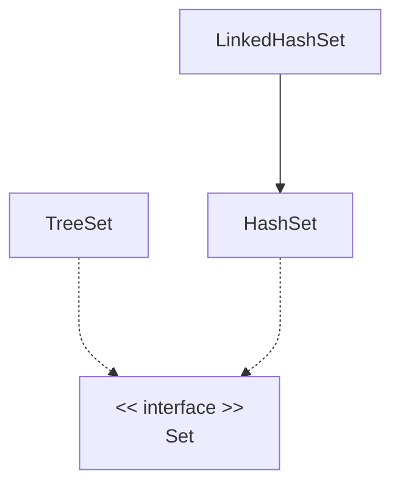
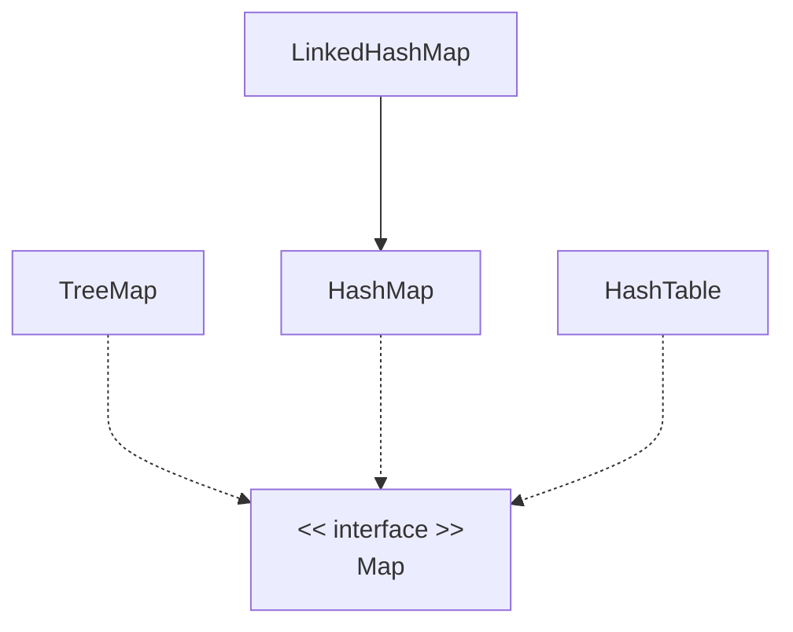

# Collections

## Collection Frameworks in Java

| Interfaces | Classes           |
| ---------- | ----------------- |
| List       | ArrayList, Vector |
| Set        | HashSet, TreeSet  |
| Map        | HashMap, TreeMap  |

- **_ArrayList_**: ordered, allows duplicates, dynamically resizable array
- **_LinkedList_**: ordered, allows duplicates, doubly linked list
- **_HashSet_**: unordered, doesn't allow duplicates, hash table
- **_TreeSet_**: unordered, doesn't allow duplicates, red-black tree
- **_HashMap_**: key-value pair, key is unique, hash table
- **_TreeMap_**: key-value pair, key is unique, red-black tree

| Type        | Collection    | Duplicates | Order | Sorted |
| ----------- | ------------- | ---------- | ----- | ------ |
| Set         | HashSet       | N          | N     | N      |
| Set         | LinkedHashSet | N          | Y     | N      |
| Set         | TreeSet       | N          | N     | Y      |
| List        | ArrayList     | Y          | Y     | N      |
| List        | Vector        | Y          | Y     | N      |
| List, Queue | LinkedList    | Y          | Y     | N      |
| Queue       | PriorityQueue | Y          | Y     | Y      |
| Map         | HashMap       | N          | N     | N      |
| Map         | TreeMap       | N          | N     | Y      |
| Map         | LinkedHashMap | N          | Y     | N      |
| Map         | HashTable     | N          | N     | N      |

## Introduction to Collections

Each entry in a collection is an **_element_**.

Some are **_ordered_**, some **_unordered_**. In **_ordered_** collections, we
can access the elements by index. Set and map are unordered. List and vector are
ordered.

Ordered collection can be **_sorted_** or **_unsorted_**. The elements are
sorted in accordance with some rule

## Collection Interfaces

| Method     | Description                               |
| ---------- | ----------------------------------------- |
| `add`      | Adds an item                              |
| `remove`   | Removes an item                           |
| `clear`    | Clears the collection                     |
| `size`     | Returns the number of elements            |
| `contains` | Checks if the collection contains an item |

The interfaces `List` (ordered), `Queue` (FIFO) and `Set` (unordered) all
**extends** the `Collection` interface.

The interface `Map` **doesn't** extend the `Collection`. Instead of `add`, it
uses `put(key, value)`. Key must be unique, one value per key.

## List Interface

- Ordered, allows duplicates

| Method        | Description                                                  |
| ------------- | ------------------------------------------------------------ |
| `get`         | Retrieve an item                                             |
| `indexOf`     | Retrieve the first position of an item (-1 if doesn't exist) |
| `lastIndexOf` | Retrieve the last position of an item (-1 if doesn't exist)  |

`ArrayList`, `LinkedList` and `Vector` implements `List`.

- `ArrayList` internally uses a dynamic array
- `LinkedList` internally uses doubly linked list. It also implements `Queue`.

## Queue Interface

- FIFO
- Items are added at the end and removed from the front

| Method | Description                     |
| ------ | ------------------------------- |
| `poll` | Remove and return item at front |
| `peek` | Return object at front          |

- `LinkedList`
- `PriorityQueue`

## Set Interface



- Unordered
- doesn't allow duplicates, adding duplicates overwrites the existing
- Only contains methods from Collection

`HashSet` and `TreeSet` implements `Set`. `LinkedHashSet` extends `HashSet`.

- `TreeSet` stores elements in a red-black tree
- `HashSet` stores elements in a hash table
- `LinkedHashSet` is like `HashSet` but additionally use a linked list to keep
  track of the **insertion order**. So this is an ordered set.

### Using a HashSet

You must override the `equals` and `hashCode` method in the class that you want
to store in a `HashSet`. Otherwise it defeats the purpose of storing unique
elements.

### Using a TreeSet

When using a `TreeSet`, either the elements must implement the `Comparable`, or
you must provide a `Comparator` object.

To provide a `Compartor` object:

```java
Set<Person> friendSet = new TreeSet<>(new FriendComparator());
```

## Map Interface

- Key-value pair, key is unique

### Methods

| Method          | Description                     |
| --------------- | ------------------------------- |
| `put`           | Add a key-value pair            |
| `get`           | Return value of given key       |
| `containsKey`   | Return true if key exists       |
| `containsValue` | Return true if value exists     |
| `keySet`        | Return a set of keys            |
| `entrySet`      | Return a set of key-value pairs |
| `values`        | Return a collection of values   |

### Map implementation



`HashMap` and `TreeMap` implements `Map`.

- `HashMap` stores elements in a hash table
- `TreeMap` stores elements in a red-black tree

See [Set Interface](#set-interface) to see requirements to use hash and tree.

## Queue Interface

- FIFO (First-In-First-Out)

`LinkedList` and `PriorityQueue` implements `Queue`.

- `LinkedList` can be used as a queue
- `PriorityQueue` stores elements based on their natural order

| Method | Descrpition                                 |
| ------ | ------------------------------------------- |
| `poll` | Removes and returns the object at the front |
| `peek` | Returns the object at the front             |

## LinkedList

| Method     | Description                   |
| ---------- | ----------------------------- |
| `addFirst` | Like add but add at beginning |

## Multi-threading and Collections

See [Threading - Concurrent Collections](threading#concurrent-collections).

## 🧭 Navigation

- [🔼 Back to top](#collections)
- [◀️ Back](index.md)
- [🔖 Parent index](index.md)
- [📑 Notes Index](../../index.md)
