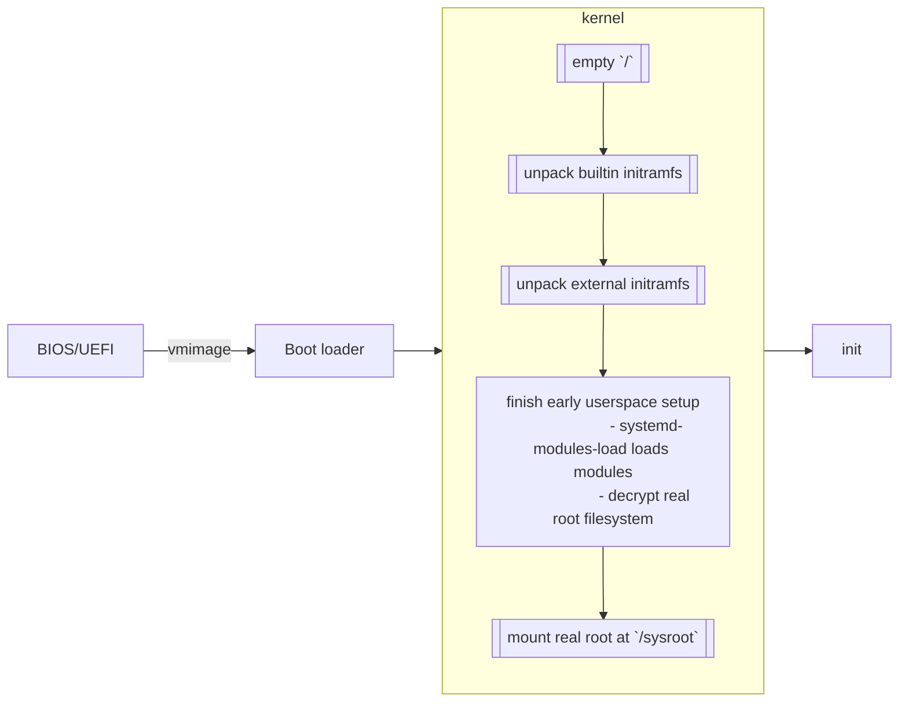

# Boot Up and Kernel

## General Intro to Booting Process

### General Diagram



### Boot loader

- Started by the _firmware_ (_BIOS_ or _UEFI_).
- For loading the kernel with kernel parameter and any external _initramfs_
  images
  - In the case of UEFI, UEFI can launch kernel directly using the EFI boot
    stub.
  - A separate boot loader can still be used for editing kernel parameters
    before booting.

### Kernel

- A low level (_kernelspace_) interacting between hardware and programs
- Boot loader boots the _vmlinux image_ containing the kernel

### [initramfs](https://wiki.archlinux.org/title/Arch_boot_process#initramfs)

- **_Initial RAM File System_**
- To bootstrap the system to the point it can access the root file system.
- Should only have modules for root device. Other modules can be loaded later by
  `udev` during the init process.

The procedures are:

1. Root file system at `/` starts out as empty rootfs
2. Kernel unpacks its builtin initramfs into the temporary root. Arch uses an
   empty archive for builtin initramfs.
3. Kernel unpacks external initramfs specified by boot loader, overwriting files
   from embedded initramfs
4. The early user space is set up

### Early userspace

Takes place while temporary rootfs is mounted. Following are done:

- `systemd-modules-load` loads kernel modules, e.g. block device modules needed
  to mount the real root file system.
- Handle decryption of the real root file system.
- Load the DRM module, as early KMS is enabled by default for in-tree modules.

Finally, the _real root_ is mounted at `/sysroot`, and then switched to. The
_late userspace_ starts by executing `init` from the real root file system.

## Grub

### References

- [ArchWiki - GRUB](https://wiki.archlinux.org/title/GRUB)

### Configuration

To generate the main config file `/boot/grub/grub.cfg`, run

```text
## grub-mkconfig -o /boot/grub/grub.cfg
```

The main config file is not supposed to change manually. Instead, its content is
influenced by
[options](https://www.gnu.org/software/grub/manual/grub/html_node/Simple-configuration.html)
in `/etc/default/grub` and scripts in `/etc/grub.d/`.

## 🧭 Navigation

- [📑 Notes Index](../../index.md)
