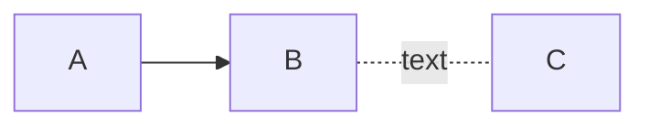
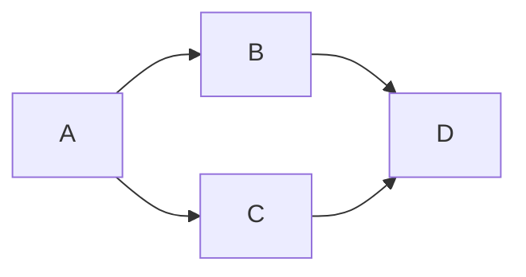
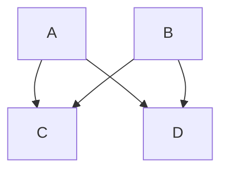
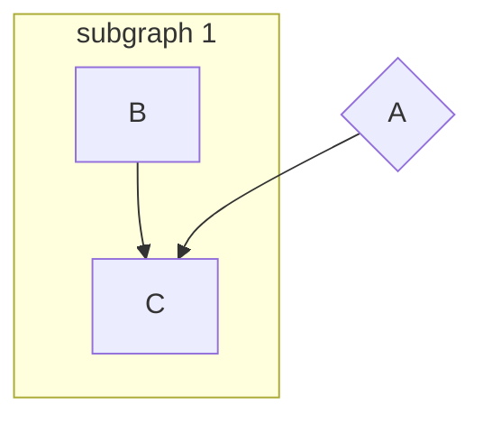
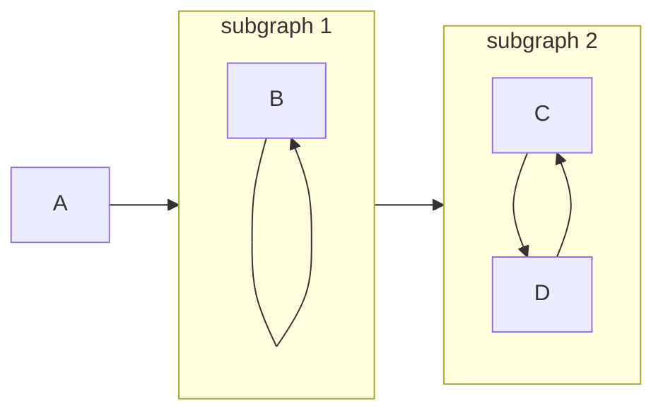
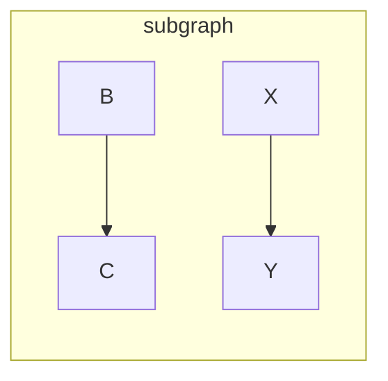
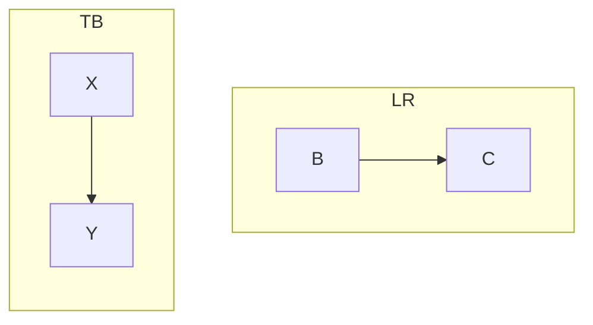
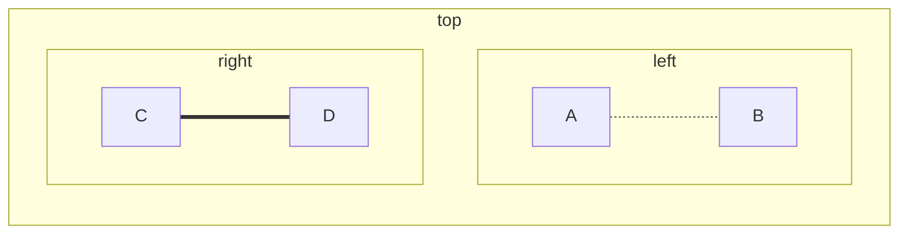
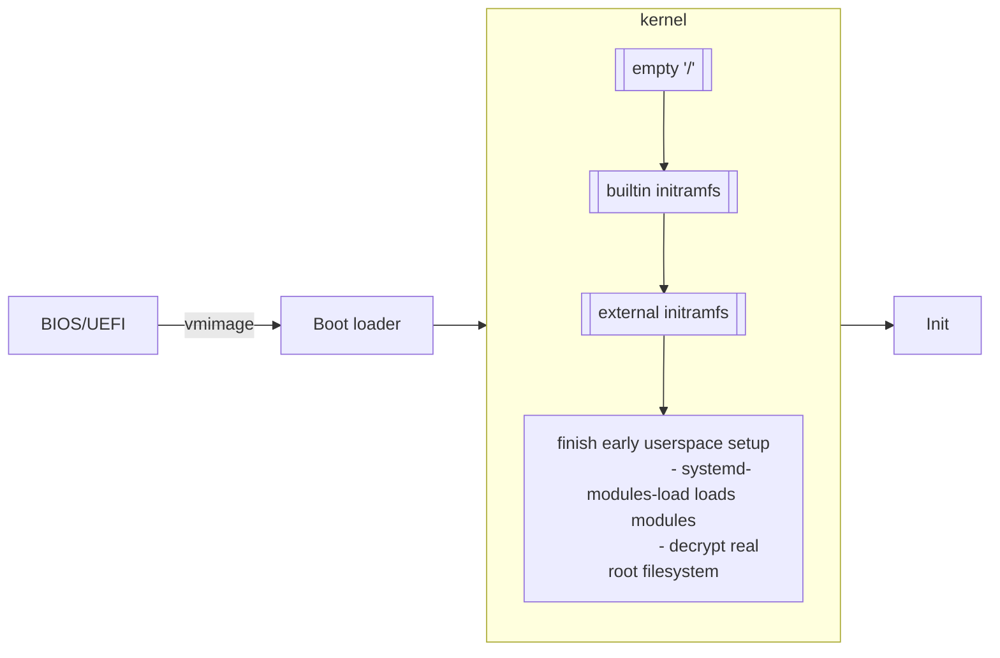

# Flowchart (Graph)

## Basic syntax

A node:

```
flowchart LR
    id1[node text] -->|arrow text| id2[node2 text]
    id2 --> id3(rounded-corner node)
    id1 --- id3
```


-   `flowchart` specifies types of diagram
-   `graph` is an alias of `flowchart`
-   `LR` specifies the direction of flowcharts

## ID naming

-   Valid characters: a-z A-Z 0-9 -
-   Can start with numbers
-   Case sensitive

## Directions

-   `TB` or `TD`: top-down (`TD` sometimes not work for `direction`)
-   `BT`: bottom-top
-   `LR`: left-right
-   `RL`: right-left

## Node content

-   To use unicode characters, enclose the node text within `""`.
-   Newer version support **Markdown** formatting. Enclose the node text within

    ```
    markdown["`This **is** _Markdown_`"]
    newlines["`Line1
    Line2
    Line3`"]
    markdown --> newlines
    ```

    ```mermaid
    flowchart LR
        markdown["`This **is** _Markdown_`"]
        newlines["`Line1
        Line2
        Line3`"]
        markdown --> newlines
    ```

## Node shapes

-   Rectangle `[ ]`

    ```mermaid
    flowchart LR
        id1[rectangle]
    ```

-   Round edges `( )`

    ```mermaid
    flowchart LR
        id1(round edges)
    ```

-   Stadium-shaped `([ ])`

    ```mermaid
    flowchart LR
        id1([stadium-shaped])
    ```

-   Subroutine shape `[[ ]]`

    ```mermaid
    flowchart LR
        id1[[subroutine shape]]
    ```

-   Cylindrical shape `[( )]`

    ```mermaid
    flowchart LR
        id1[(database)]
    ```

-   Circle `(( ))`

    ```mermaid
    flowchart LR
        id1((circle))
    ```

-   Asymmetrical flag `> ]`

    ```mermaid
    flowchart LR
        id1>assymmetrical flag]
    ```

-   Diamond (rhombus) `{ }`

    ```mermaid
    flowchart LR
        id1{diamond}
    ```

-   Hexagon `{{ }}`

    ```mermaid
    flowchart LR
        id1{{hexagon}}
    ```

-   Parallelogram `[/ /]`

    ```mermaid
    flowchart LR
        id1[/paralleloogram/]
    ```

-   Parallelogram alt `[\ \]`

    ```mermaid
    flowchart LR
        id1[\parallelogram alt\]
    ```

-   Trapezoid `[/ \]`

    ```mermaid
    flowchart LR
        id1[/trapezoid\]
    ```

-   Trapezoid alt `[\ /]`

    ```mermaid
    flowchart LR
        id1[\trapezoid alt/]
    ```

-   Double circle `((()))`

    ```mermaid
    flowchart LR
        id1(((double circle)))
    ```

## Links and arrow style

### Links style

You can make the link **longer** by repeating the defining character of the
link. (e.g. `.` for dotted link `-.-`). Actually it is to **increase the rank**
(in column or row depending on direction).

-   Open link `---`

    ```mermaid
    flowchart LR
        A---B
    ```

-   Dotted link `-.-`.

    ```mermaid
    flowchart LR
        A-.-B
    ```

-   Thick link `===` (or `==` with an arrow head)

    ```mermaid
    flowchart LR
        A===B
    ```

-   Invisible link `~~~` (Useful to alter positioning of nodes)

    ```mermaid
    flowchart LR
        A~~~B
    ```

### Arrow style

You can add arrow head on either side.

-   Arrow head `<-->`

    ```mermaid
    flowchart LR
        A<-->B
    ```

-   Dot `o.-o`

    ```mermaid
    flowchart LR
        Ao.-oB
    ```

-   Cross `x==x`

    ```mermaid
    flowchart LR
        Ax==xB
    ```

## Texts on links

-   `A --> |text| B`
-   `A -- text --> B`
-   `A -. text .-> B`
-   `A .- text --> B`

## Chaining links

You can also chain multiple links `A --> B -.text.- C`:



Multiple nodes links `A --> B & C --> D`:



Even this `A & B --> C & D`:



## Subgraphs

### Basic syntax

```
subgraph id1[title]
    graph definition
end
```

### Connecting nodes within/out subgraphs

```
flowchart TB
    A{A}
    subgraph sg1[subgraph 1]
        B --> C
    end
    A --> C
```



### Connecting with other nodes/subgraphs

```
flowchart LR
    subgraph sg1[subgraph 1]
        B --> B
    end
    subgraph sg2[subgraph 2]
        C --> D --> C
    end
    sg1 --> sg2
    A --> sg1
```



### Repeating definition

```
flowchart LR
    subgraph sg1[subgraph]
        B --> C
    end
    subgraph sg1
        X --> Y
    end
```



### Setting directions

```
flowchart TD
    subgraph sg1[LR]
        direction LR
        B --> C
    end
    subgraph sg2[TB]
        direction TB
        X --> Y
    end
```



### Nested subgraphs

```
flowchart LR
    subgraph sg-top[top]
        direction TB
        subgraph sg1[left]
            A -.- B
        end
        subgraph sg2[right]
            C === D
        end
    end
```



## Example with tips



```
flowchart LR
    bios[BIOS/UEFI]
    bootloader[Boot loader]
    kernel[Kernel]
    init[Init]
    bios --vmimage--> bootloader --> kernel --> init
    subgraph kernel
        direction TB
        tmproot[["empty '/'"]]
            --> b-initramfs[[builtin initramfs]]
            --> e-initramfs[[external initramfs]]
            --> early-userspace["
                    finish early userspace setup
                    - systemd-modules-load loads modules
                    - decrypt real root filesystem
                "]
    end
```

-   Use indents
-   Declare node first, then define relations
-   Chaining by starting a new line with links

# 🧭 Navigation

-   [🔼 Back to top](#)
-   📑 [Index](../../../index.md)

# Vim Modelines

<!-- vim: set fdl=1: -->
