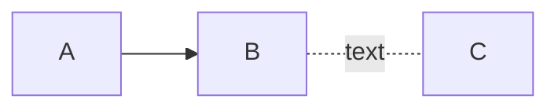
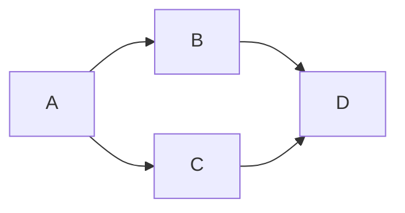
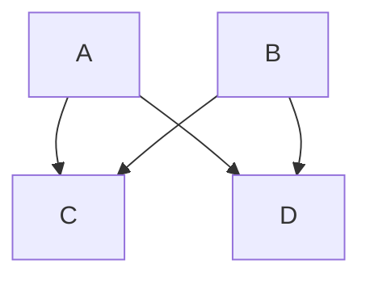
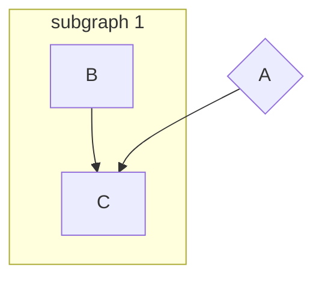
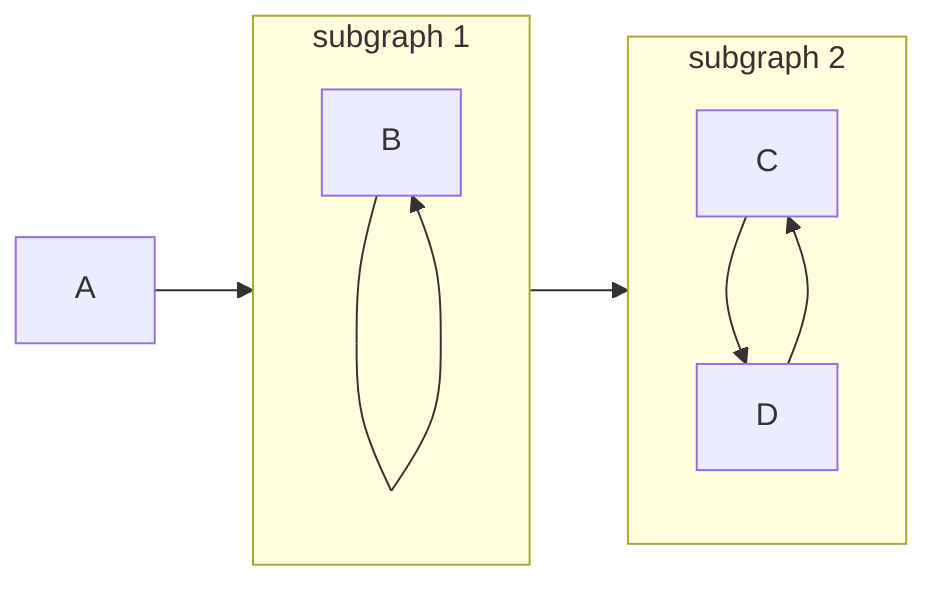
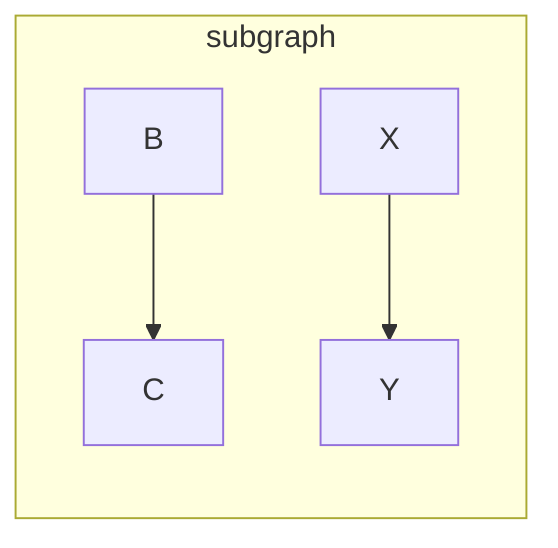
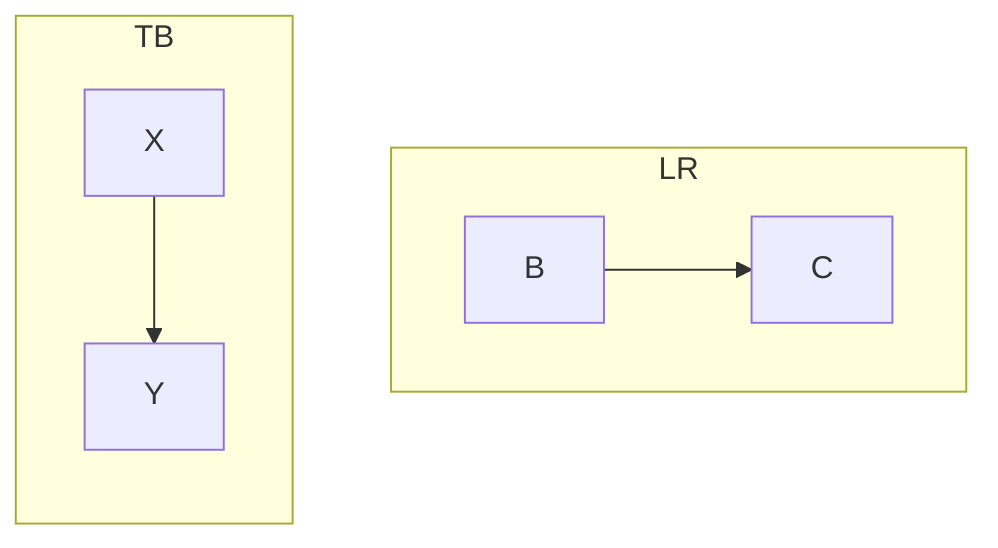
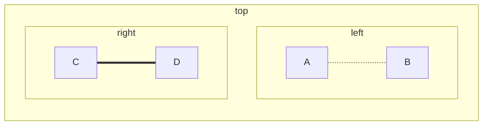
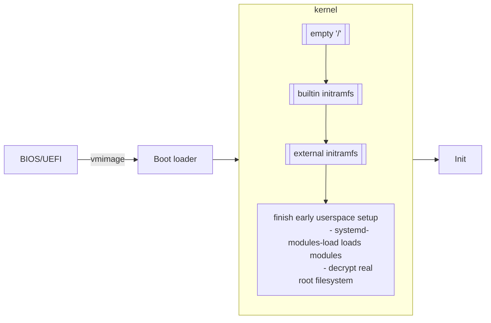
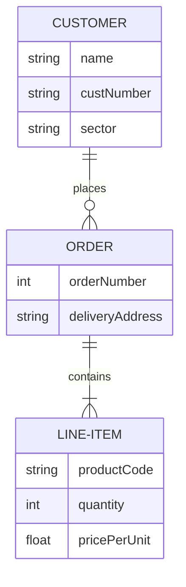

# Mermaid

## Flowchart (Graph)

### Flowchart syntax

A node:

```text
flowchart LR
    id1[node text] -->|arrow text| id2[node2 text]
    id2 --> id3(rounded-corner node)
    id1 --- id3
```


- `flowchart` specifies types of diagram
- `graph` is an alias of `flowchart`
- `LR` specifies the direction of flowcharts

### ID naming

- Valid characters: a-z A-Z 0-9 -
- Can start with numbers
- Case sensitive

### Directions

- `TB` or `TD`: top-down (`TD` sometimes not work for `direction`)
- `BT`: bottom-top
- `LR`: left-right
- `RL`: right-left

### Node content

- To use unicode characters, enclose the node text within `""`.
- Newer version support **Markdown** formatting. Enclose the node text within a
  pair of backticks (\`).

  ```text
  markdown["`This **is** _Markdown_`"]
  newlines["`Line1
  Line2
  Line3`"]
  markdown --> newlines
  ```

  ```mermaid
  flowchart LR
      markdown["`This **is** _Markdown_`"]
      newlines["`Line1
      Line2
      Line3`"]
      markdown --> newlines
  ```

### Node shapes

- Rectangle `[ ]`

  ```mermaid
  flowchart LR
      id1[rectangle]
  ```

- Round edges `( )`

  ```mermaid
  flowchart LR
      id1(round edges)
  ```

- Stadium-shaped `([ ])`

  ```mermaid
  flowchart LR
      id1([stadium-shaped])
  ```

- Subroutine shape `[[ ]]`

  ```mermaid
  flowchart LR
      id1[[subroutine shape]]
  ```

- Cylindrical shape `[( )]`

  ```mermaid
  flowchart LR
      id1[(database)]
  ```

- Circle `(( ))`

  ```mermaid
  flowchart LR
      id1((circle))
  ```

- Asymmetrical flag `> ]`

  ```mermaid
  flowchart LR
      id1>assymmetrical flag]
  ```

- Diamond (rhombus) `{ }`

  ```mermaid
  flowchart LR
      id1{diamond}
  ```

- Hexagon `{{ }}`

  ```mermaid
  flowchart LR
      id1{{hexagon}}
  ```

- Parallelogram `[/ /]`

  ```mermaid
  flowchart LR
      id1[/paralleloogram/]
  ```

- Parallelogram alt `[\ \]`

  ```mermaid
  flowchart LR
      id1[\parallelogram alt\]
  ```

- Trapezoid `[/ \]`

  ```mermaid
  flowchart LR
      id1[/trapezoid\]
  ```

- Trapezoid alt `[\ /]`

  ```mermaid
  flowchart LR
      id1[\trapezoid alt/]
  ```

- Double circle `((()))`

  ```mermaid
  flowchart LR
      id1(((double circle)))
  ```

### Links and arrow style

#### Links style

You can make the link **longer** by repeating the defining character of the
link. (e.g. `.` for dotted link `-.-`). Actually it is to **increase the rank**
(in column or row depending on direction).

- Open link `---`

  ```mermaid
  flowchart LR
      A---B
  ```

- Dotted link `-.-`.

  ```mermaid
  flowchart LR
      A-.-B
  ```

- Thick link `===` (or `==` with an arrow head)

  ```mermaid
  flowchart LR
      A===B
  ```

- Invisible link `~~~` (Useful to alter positioning of nodes)

  ```mermaid
  flowchart LR
      A~~~B
  ```

#### Arrow style

You can add arrow head on either side.

- Arrow head `<-->`

  ```mermaid
  flowchart LR
      A<-->B
  ```

- Dot `o.-o`

  ```mermaid
  flowchart LR
      Ao.-oB
  ```

- Cross `x==x`

  ```mermaid
  flowchart LR
      Ax==xB
  ```

### Texts on links

- `A --> |text| B`
- `A -- text --> B`
- `A -. text .-> B`
- `A .- text --> B`

### Chaining links

You can also chain multiple links `A --> B -.text.- C`:



Multiple nodes links `A --> B & C --> D`:



Even this `A & B --> C & D`:



### Subgraphs

#### Subgraphs syntax

```text
subgraph id1[title]
    <graph definition>
end
```

#### Connecting nodes within/out subgraphs

```text
flowchart TB
    A{A}
    subgraph sg1[subgraph 1]
        B --> C
    end
    A --> C
```



#### Connecting with other nodes/subgraphs

```text
flowchart LR
    subgraph sg1[subgraph 1]
        B --> B
    end
    subgraph sg2[subgraph 2]
        C --> D --> C
    end
    sg1 --> sg2
    A --> sg1
```



#### Repeating definition

```text
flowchart LR
    subgraph sg1[subgraph]
        B --> C
    end
    subgraph sg1
        X --> Y
    end
```



#### Setting directions

```text
flowchart TD
    subgraph sg1[LR]
        direction LR
        B --> C
    end
    subgraph sg2[TB]
        direction TB
        X --> Y
    end
```



#### Nested subgraphs

```text
flowchart LR
    subgraph sg-top[top]
        direction TB
        subgraph sg1[left]
            A -.- B
        end
        subgraph sg2[right]
            C === D
        end
    end
```



### Example with tips



```text
flowchart LR
    bios[BIOS/UEFI]
    bootloader[Boot loader]
    kernel[Kernel]
    init[Init]
    bios --vmimage--> bootloader --> kernel --> init
    subgraph kernel
        direction TB
        tmproot[["empty '/'"]]
            --> b-initramfs[[builtin initramfs]]
            --> e-initramfs[[external initramfs]]
            --> early-userspace["
                    finish early userspace setup
                    - systemd-modules-load loads modules
                    - decrypt real root filesystem
                "]
    end
```

- Use indents
- Declare node first, then define relations
- Chaining by starting a new line with links

## Entity Relationship Diagram (ERD)

### Crow's Foot Notation

Mermaid uses **_crow's foot notation_** (**_IE notation_**). This notation uses
graphical symbols to indicate the "many" side of the relationship. The
three-pronged "many" symbol is also how this widely-used notation style got its
name.

#### Why this notation?

The idea is to not use arrow so it doesn't imply directionality or physical
access path. The "inverted arrow", or "fork" notation `[X] --< [Y]` visually
shows individual X can relate to multiple Ys and each Y relates to at most one
X.

You don't need to include every attribute in the diagram.

#### Notation

##### Entities

An entity represent a class of object. It is represented by a **rectangle**,
with its name on the top. The name is singular, often capitalized.

##### Attributes

An attribute is a property that describes a particular entity. Usually
attributes contributing the primary key are marked with an asterisk `*`.

##### Relationships

Represented by straight line. Usually has a name, expressed as a verb, written
on the line.

Relationships have two indicators, shown on both sides of the line.

- First indicates cardinality (or multiplicity): one or many. `|` for one,
  forked like `>` for many.
- Second indicates participation: optional or mandatory. `|` for mandatory, `o`
  for optional.

##### Identifying relationships

Identifying and non-identifying relationships are represented by solid `--` and
dashed `..` lines respectively.

### ERD Basic Example

- A customer can place zero or more orders
- An order must be placed by one and only one customer
- An order must contain one or more line items
- A line item must be part of one and only one order
- Customer identifies order identifies line-item



### ERD Syntax

- Use double quotes for labels if contain spaces.

#### Declare entity or define relationship

`<entity1> [<relationship> <entity2> : <relationship-label>]`

- `<entity1>` alone represent a stand-alone entity.
- If any of the remaining parts are given, all parts must be given.
- For `<relationship>`:
  - Either use crow's foot notation:
    - `|` for one, `{` and `}` for many (fork), `o` for optional.
    - `--` and `..` for solid and dashed lines respectively.
  - Or use word aliases `<alias-left> to <alias-right>`:
    - `zero or one`, `one or zero`
    - `one or more`, `one or many`, `many(1)`, `1+`
    - `zero or more`, `zero or many`, `many(0)`, `0+`
    - `only one`, `1`
    - `to` (solid) or `optionally to` (dashed)
- Entity name begins with alphabet or an underscore (from v10.5.0+), then may
  also contain digits and hyphens.
- Use empty double-quoted string for empty relationship label.

The following two are equivalent:

```text
CAR ||--o{ NAMED-DRIVER : allows
CAR 1 to 0+ NAMED-DRIVER : allows
```

#### Define attributes

```text
<entity> {
  <attr-type> <attr-name> [<key-types>]  ["<remarks>"]
  ...
}
```

- `<attr-type>` begins with alphabet, then may also contain digits, hyphens,
  underscores, parentheses and square brakcets.
- `<attr-name>` has a similar format as `<attr-type>`, but may start with an
  **asterisk** to indicate primary key.
- In `<entity>` you can define an alias for the entity: `a["Customer Account"]`
- `<key-types>` is a comma-separated list of key types, including `PK` (primary
  key), `FK` (foreign key) and `UK` (unique key).
- `<remarks>` must be enclosed in double quotes and at the last of the line. It
  cannot contain double quotes.

```text
CAR {
  string registrationNumber PK
  string make
  string model
  string[] parts
}

PERSON {
  string driversLicense PK "The license #"
  string(99) firstName "Max 99 chars"
  string lastName
  string phone UK
  int age
}

NAMED-DRIVER {
  string carRegistrationNumber PK, FK
  string driverLicense PK, FK
}
```

## 🧭 Navigation

- [🔼 Back to top](#)
- 📑 [Index](../../../index.md)

## Vim Modelines

<!-- vim: set fdl=1: -->
