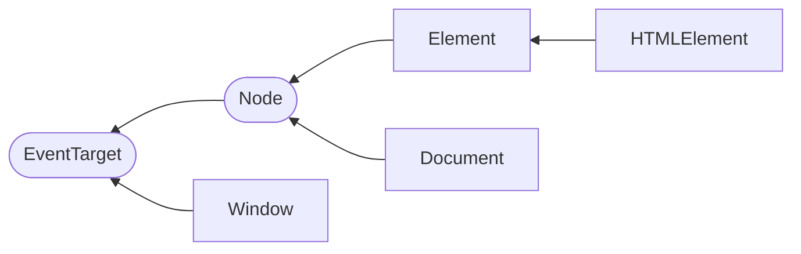

# DOM Manipulation

## Basic Structure

- `Navigator` object
- `Window` object
- `Document` object

## Document Object Model

### Overview

- Name is **_Document object model_** or **_DOM_**.
- It represents a whole document in a tree structure of **_nodes_**.
- It is object oriented where each node is an object with its own properties.
- It is not part of JavaScript, but an API for languages to access and
  manipulate the document. (E.g. python has a library that does the same thing)
- `document` object represents the root of the document itself. `window` object
  represents something like the browser.

Terms describing node hierarchy in the tree:

- _Root node_: Top node; HTML
- _Child node_: Node directly inside another
- _Descendant node_: Node anywhere inside another
- _Parent node_: Node that has another node inside it
- _Sibling node_: Node that sit on the same level in DOM

### Fundamental data types

Data types (interfaces):

- `Document`

  When a member returns an object of type `document` (e.g. the `ownerDocument`
  property of an element returns the `document` to which it belongs), this
  object is the root `document` object itself.

- `Node`

  Every object located within a document is a node of some kind. In an HTML
  document, it can be an _element_ node, a _text_ node or an _attribute_ node.

- `Element`

  The `element` type is based on `node`. `element` objects implement the DOM
  `Element` interface and also the more basic `Node` interface. In an HTML
  document, elements are further enhanced by HTML DOM API's `HTMLElement`
  interface as well as other interfaces describing capabilities of specific
  kinds of elements, e.g. `HTMLTableElement`.

- `NodeList`

  An array of elements. Items can be accessed by `list.item(idx)` or
  `list[idx]`.

- `Attr`

  When an `attribute` is returned by a member (e.g. by `createAttribute()`
  method), it is an object reference that exposes a special (albeit small)
  interface for attributes. Attributes are nodes in the DOM just like elements.

- `NamedNodeMap`

  A `namedNodeMap` is like an array, but the items are accessed by name or
  index, though this latter case is merely a convenience for enumeration, as
  they are in no particular order in the list. A `namedNodeMap` has an `item()`
  method for this purpose, and you can also add and remove items from a
  `namedNodeMap`.

### List of core interfaces in the DOM

- `document.querySelector()`
- `document.querySelectorAll()`
- `document.createElement()`
- `Element.innerHTML`
- `Element.setAttribute()`
- `Element.getAttribute()`
- `EventTarget.addEventListener()`
- `HTMLElement.style`
- `Node.appendChild()`
- `Node.removeChild()`
- `Node.parentNode`
- `Node.childNodes`
- `Node.textContent`
- `window.onload`
- `window.scrollTo()`

### DOM Interfaces Structure

`Nodes` and `EventTarget` are _abstract_ interfaces (can't create instances).

There are subclasses of `HTMLElement`:

- `HTMLAnchorElement`

`window` has `document`.

### NodeList

`myNodeList[idx]`: Access node of at idx.

#### Instance properties

`length`: the number of nodes

#### Instance methods

| Method          | Description                            |
| --------------- | -------------------------------------- |
| `item(idx)`     | Return item at idx, or `null`          |
| `entries()`     | Return `iterator` of key-value pairs   |
| `forEach(func)` | Call func for each element as argument |
| `keys()`        | Return `iterator` of keys              |
| `values()`      | Return `iterator` of values            |

## Node Query

- `querySelector()` returns first matching node
- `querySelectorAll()` returns a **static** `NodeList`
- `getElementById()` returns first matching node
- `getElementsByClassName()` returns a **live** `HTMLCollection`
- `getElementsByTagName()` returns a **live** `HTMLCollection`

Since an `HTMLCollection` in the HTML DOM is **live**, i.e. the content reflect
changes in real time, it may be desirable to use `Array.from` to make an array
copy.

## Modifying Nodes

### Modifying attributes

Most HTML attributes (except class) are accessed through instance
**properties**. Here are some other instance properties:

- `textContent`: Text content
  - You can also `document.createTextNode("Some text")` and append it
- `innerHTML`: Inner HTML
- `classList`: provides methods to modify class
  - `add(class...)`
  - `remove(class...)`
  - `replace(oldClass, newClass)`
  - `toggle(class)`
  - `toggle(class, [force])`: force is true then only add class, false then only
    remove class.

You can use `Element.setAttribute(attr, value)` to set an attribute (including
class), and `Element.removeAttribute(attr)` to remove.

Note that for **boolean** attribute, setting any value at all (e.g. `""`) means
true. You need to remove the attribute to really make the value false.

### Changing classes

- `Element.classList.addClass()`
- `Element.classList.removeClass()`

### Manipulating styles

- `Document.stylesheets` gives you an array-like object with `CSSStyleSheet`
  objects. This is an old way to manipulate style.
- `HTMLElement.style` refers to an object containing styling info. The key names
  for a CSS property is the **camel case** equivalent of CSS property name.

## Creating Nodes

- `document.createElement("p")` creates a `
` element.
- `Node.cloneNode()` clones a node.

## Modifying DOM Tree

- Inserting an already connected node results in **moving** them.
- Most methods return `undefined`. You can check documentation to make sure.

### Element instance methods

| Method                            | Description                                                   |
| --------------------------------- | ------------------------------------------------------------- |
| `before(arg...)`                  | Insert `Node` or string as prev sibling                       |
| `after(arg...)`                   | Insert `Node` or string as next sibling                       |
| `prepend(arg...)`                 | Prepend `Node` or string as first child                       |
| `append(arg...)`                  | Append `Node` or string as last child                         |
| `insertAdjacentElement(pos, ele)` | Insert element at relative [position](#insertadjacentelement) |

| Method     | Description          |
| ---------- | -------------------- |
| `remove()` | Remove self from DOM |

| Method                    | Description                            |
| ------------------------- | -------------------------------------- |
| `replaceWith(arg...)`     | Replace self with `Node` or string     |
| `replaceChildren(arg...)` | Replace children with `Node` or string |

### Node instance methods

Node instance methods

| Method              | Description                 |
| ------------------- | --------------------------- |
| `appendChild(node)` | Append a node as child node |
| `removeChild(node)` | Remove a child node         |

In older browser where `remove()` is not supported, you need to
`node.parentNode.removeChild(node)`

### Delay before inserted element is ready

Sometimes it takes time before an element newly inserted into DOM is ready. And
this may result to failure in calling certain methods on the element.

E.g. `focus()` can fails when called immediately after the element is added to
DOM. You may want to add a delay with `setTimeout(() => {myEle.focus()}, 0)`.

### insertAdjacentElement

Position can be:

| Value         | Description                    |
| ------------- | ------------------------------ |
| `beforebegin` | Before self                    |
| `afterbegin`  | Just inside before first child |
| `beforeend`   | Just inside after last child   |
| `afterend`    | After self                     |

## DOM Traversal

### Note that...

- Many `NodeList` returned are **live**. Keep this in mind when making decisions
  like caching the length for iteration
  - You can use `Array.from()` to turn it into an array
- For `Node`, it can be `Text` (a **whitespace**) or `Comment` node
- Most properties are **read-only**
- You should combine with [**query** methods](#node-query) to better traverse
  the DOM, the query will only be done in the subtree.

### Ancestors

Element instance method:

| Method              | Description                                            |
| ------------------- | ------------------------------------------------------ |
| `closest(selector)` | Cloesest matching Self or ancestor `Element` or `null` |

Node instance property:

`parentNode`: read-only.

### Siblings

Element instance properties:

| Property                 | Return value                     |
| ------------------------ | -------------------------------- |
| `nextElementSibling`     | Next sibling `Element` or `null` |
| `previousElementSibling` | Prev sibling `Element` or `null` |

Node instance properties:

| Property          | Return value                  |
| ----------------- | ----------------------------- |
| `nextSibling`     | Next sibling `Node` or `null` |
| `previousSibling` | Prev sibling `Node` or `null` |

### Descendants

Element instance properties:

| Property            | Return value                            |
| ------------------- | --------------------------------------- |
| `childElementCount` | Number of child elements                |
| `children`          | Live `HTMLCollection` of child elements |
| `firstElementChild` | First child `Element` or `null`         |
| `lastElementChild`  | Last child `Element` or `null`          |

Node instance properties:

| Property     | Return value                 |
| ------------ | ---------------------------- |
| `childNodes` | Live `NodeList`              |
| `firstChild` | First child `Node` or `null` |
| `lastChild`  | Last child `Node` or `null`  |

## Node Testing and Assertion

Element instance method:

| Method                      | Description                         |
| --------------------------- | ----------------------------------- |
| `matches(selector)`         | Test whether self would be selected |
| `classList.contains(class)` | Test whether belong to a class      |

Node instance property:

| Property      | Description                              |
| ------------- | ---------------------------------------- |
| `isConnected` | Test if connected to a `Document` object |

## Getting Node Info

Element instance methods:

| Method                    | Description                                 |
| ------------------------- | ------------------------------------------- |
| `getBoundingClientRect()` | Return `DOMRect` object indicating geometry |

## Other Node Builtin Methods

- `HTMLElement.focus()` to focus an element and scrolling to it.
  - Passing an argument `true` will prevent scrolling.

## Links

- [Document Object Model - mdn web docs](https://developer.mozilla.org/en-US/docs/Web/API/Document_Object_Model)
- [Node - mdn web docs](https://developer.mozilla.org/en-US/docs/Web/API/Node)
- [Element - mdn web docs](https://developer.mozilla.org/en-US/docs/Web/API/Element)

## 🧭 Navigation

- [🔼 Back to top](#)
- [◀️ Back](index.md)
- [🔖 Parent index](index.md)
- [📑 Notes Index](../../index.md)
- [🗃️ Master Index](../../../index.md)
