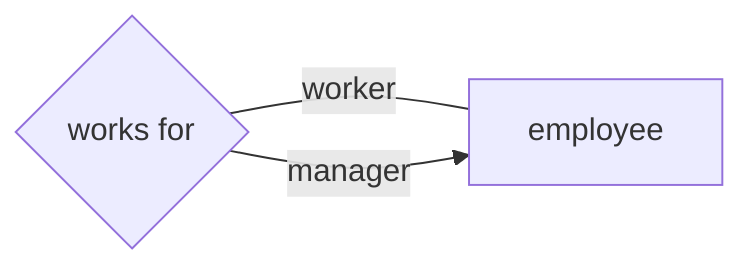
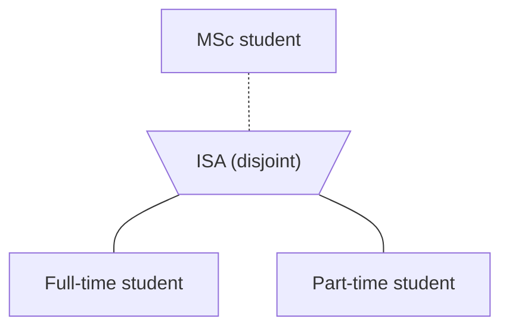
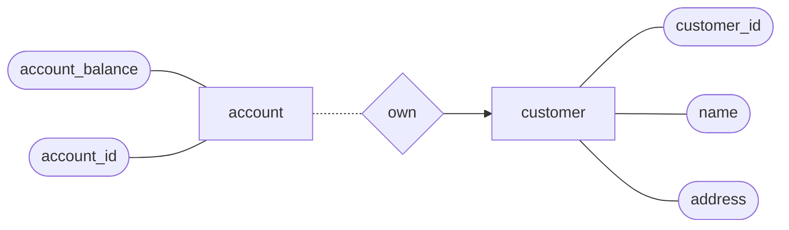
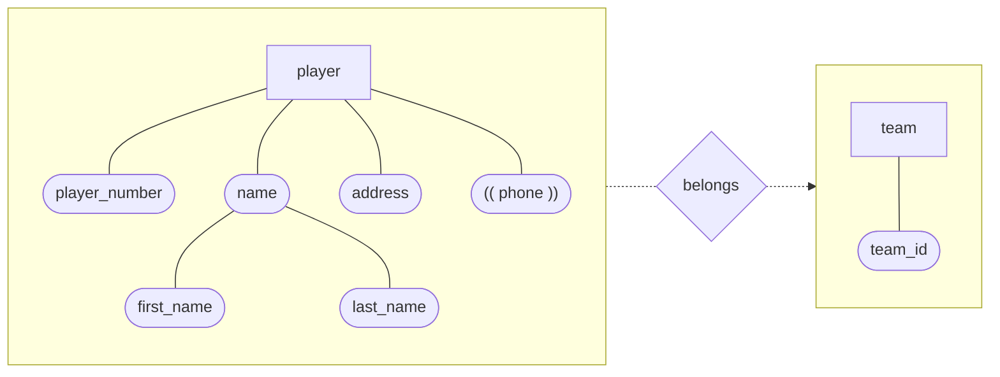

# Databases

## Data Modeling

Efficiency

- Space
- Speed
- If small enough, and load to memory, then there is no I/O cost

Database languages

- **_Data definition language_** (_DDL_): Define the data model
- **_Data manipulation language_** (_DML_): Search for records, adding new
  entity

## E-R Model

### Entity and Entity Set

**_Entity_**

- An object that exists and is distinguishable from other objects
- E.g. A customer, an account, a department, etc.
- Have **attributes**, e.g. people have name and address

**_Entity set_**

- A set of entities of the same type that share the same properties (attributes)

### Relationship

- A **_relationship_** is an association among entities.
- A **_relationship set_** is a set of relationships of the same type.

#### Constraints

**_Mapping cardinalities_** concerns the number of entities to which another
entity can be associated via a relationship set. E.g. how many accounts can a
customer have?

**_Participation constraints_** concerns whether all entities in an entity set
have to participate in a relationship set. E.g. must every customer have an
account?

### Keys

#### Super key

A **_super key_** of an entity set is a **set** of one or more attributes whose
values uniquely determine each entity.

E.g. if `{customer_id}` is a super key, `{customer_id, name}` is another super
key.

#### Candidate key

A **_candidate key_** of an entity set is a **minimal** super key. I.e. no
proper subset of a candidate key is still a super key.

#### Primary key

Although several candidate keys may exist, one of the candidate keys is
**selected** to be the **_primary key_**.

In the E-R diagram, the primary key is **underlined**.

### Attribute Types

- Single vs **_composite attributes_** (consisting of **_component
  attributes_**)
- Single-valued vs **_multi-valued attributes_** (represented in **double
  ellipses** in E-R diagram)
- **_Derived attributes_** can be derived from other attributes.
  - Represented in **dashed ellipses** in E-R

### Weak Entity Set

A **_weak entity set_** is an entity set that does not have a primary key.

The existence of a weak entity set depends on the existence of a **_identifying
entity set_**. The weak entity set must relate to its identifying entity set via
a **total, many-to-one** **_identifying relationship set_** from the weak entity
set to the identifying set.

We depict a weak entity set by a **double rectangle**. We depict an identifying
relationship set by a **double diamond**.

The **_discriminator_** (or **_partial key_**) of a weak entity set is a set of
attributes that distinguishes the weak entities that depends on the same
identifying entity. So the "primary key" of a weak entity set is formed by the
primary key of the identifying set plus the discriminator.

### Role

Entity sets of a relationship **need not be distinct**.



The label "manager" and "worker" are called **_roles_**. They specify how
employee entities interact via the works-for relationship set.

### Specialization and Generalization

#### Specialization

Entities can be _specialized_ from a higher-level entity set to a lower-level
entity set which **inherits** all attributes and relationship set participation.
Lower-level entity set can have its own attributes.

Specialization can be:

- _total_ (double line) or _partial_ (single line)
- _Disjoint_ or _overlapping_ (default is overlapping)

Specialization is represented by an **inverted triangle** labeled as "ISA",
meaning _is-a_ relationship.



(Mermaid doesn't have triangle, so use trapezoid instead)

### E-R Diagram

#### Shapes

| Shape                             | Description      |
| --------------------------------- | ---------------- |
| Rectangle                         | Entity set       |
| Ellipse                           | Attribute        |
| Diamond                           | Relationship set |
| Inverted triangle (labeled "ISA") | Specialization   |

##### Ellipses

| Variant | Description            |
| ------- | ---------------------- |
| Double  | Multi-valued attribute |
| Dashed  | Derived attribute      |

##### Rectangles

| Variant | Description     |
| ------- | --------------- |
| Double  | Weak entity set |

##### Diamond

| Variant | Description                  |
| ------- | ---------------------------- |
| Double  | Identifying relationship set |

##### Triangle

| Variant            | Description              |
| ------------------ | ------------------------ |
| Labeled "disjoint" | Disjoint specialisations |

#### Lines

| Line            | Description           |
| --------------- | --------------------- |
| directional     | one                   |
| non-directional | many                  |
| double          | total participation   |
| single          | partial participation |

An account can be associated with at most one customer:

```text
[customer] <- <owner> [account]
```

An account can be associated with more than one customers:

```text
[customer] -- <owner> [account]
```

Each customer must have an account:

```text
[customer] == <owner> [account]
```

Not all customers are required to have an account:

```text
[customer] -- <owner> [account]
```

#### Example

A customer can have any amount of accounts, but each account must belongs to one
and only one customer.



(mermaid doesn't support double line, so use dashed line instead)

You can read the diagram like a sentence:

- A customer _can_ (1st line is single line) own _many_ (2nd line is
  non-directional) accounts.
- An account _must_ (1st line is double line) be owned by _one_ (2nd line is
  directional) customer.

#### Building E-R diagrams

1. Identify the entity sets
2. Identify the relationship sets
3. Identify the attributes
4. Mapping cardinalities

### Design

#### Entity vs Attribute

Modelling employee and their phone numbers.

| Scenario                         | Attribute    | Entity                   |
| -------------------------------- | ------------ | ------------------------ |
| Multiple numbers                 | Multi-valued | `👤 <-- <has> --- 📞`    |
| Shared numbers                   | ❌           | `👤 --- <has> --- 📞`    |
| Keep missed call for each number | ❌           | `📞 --- ((missed_call))` |

#### Entity Sets vs Relationship Sets

Entity set usually in **noun**, whereas relationship set usually in **verb**.

Modelling a loan:

`[loan]` or `[customer] --- <loan> --- [branch]`

| Scenario   | Entity Set                           | Relationship Set |
| ---------- | ------------------------------------ | ---------------- |
| Joint loan | `[customer] --- <borrow> --- [loan]` | ❌               |

### Relational Tables

#### Entity sets and attributes

- An _entity set_ (or strong entity set) _reduces_ to a **table** with the same
  attributes.
- _Composite attributes_ are _flattened_ into separate attributes in **dot
  notation**.
- A _multi-valued attribute_ _M_ of an entity set _E_ is represented by a
  **separate table _EM_** with the primary key as one of _EM_'s attribute.
  - It's like many-to-one relationship set, with total participation on the
    many-side.
- A _weak entity set_ becomes a table that includes the columns for the
  **primary key of the identifying entity set**.



| team_id | player_number | name.first_name | name.last_name | address |
| ------- | ------------- | --------------- | -------------- | ------- |
| ...     | ...           | ...             | ...            | ...     |

| player_number | phone     |
| ------------- | --------- |
| 1             | 1234 5678 |
| 1             | 2234 5678 |

#### Relationship sets

##### Many-to-many

A table with columns for the primary keys of the participating entity sets, and
any attributes of the relationship set.

```text
[team] --- <has> --- [sponsor]
```

| team_id | sponsor_id | sponsor_date |
| ------- | ---------- | ------------ |
| 1       | 1          | 2013-1-1     |
| 2       | 1          | 2013-9-1     |

`Team_asoc_sponsor` (**`team_id`**, **`sponsor_id`**, `sponsor_date`)

##### Many-to-one

If there's **total participation** on the _many-side_, add extra attributes to
the table on the many-side.

```text
[car] === <own> --> [person]
```

| car_number | ownership_date | person_id | ... |
| ---------- | -------------- | --------- | --- |
| HV2299     | 2013-10-1      | 1         | ... |

| person_id | ... |
| --------- | --- |
| 1         | ... |

##### One-to-one

Either side can be chosen to act as the _many-side_ as in many-to-one with total
participation on the many-side.

##### Procedure

1. Entity sets
   - Each entity set becomes a table
   - Attribute becomes a column, each entity becomes a tuple
2. Relationship set
   - Whether a relationship set becomes a table depends on the mapping
     cardinality.
3. Identify the key
   - What is the primary key? Any foreign key?

#### Specialization with Tables

Two methods:

- Table of lower-level entity set contains the **primary key** of the
  higher-level entity set and **local attributes**.
- Table of lower-level entity set contains **all local and inherited**
  attributes.

If the specialization is **total**, then we don't need to have a table for
higher-level entity set.

#### Foreign Key

A **_foreign key_** is a **referential constraint** between two tables. It is a
field in a relational table that matches a candidate key of another table.

It's used to cross-reference tables. It's an essential part of _database
normalization_.

- `Author` (`author_id`, `name`, `date_of_birth`)
- `Book` (`book_id`, `title`, `publisher`)
- `Writes` (**`author_id`**, **`book_id`**)

## Relational Algebra

### What is relational algebra?

- Like algebra, but relations (tables) as operands and a new set of operators.
- Inner, lower-level operations of a relational DBMS are (or are similar to)
  relational algebra operations.
- Need to know relational algebra to understand query execution and optimization
  in a relational DBMS.

### Basic Operators

- **_Selection_** ($\sigma$): Selects rows that satisfy a selection condition
- **_Projection_** ($\pi$): Selects columns
- **_Cartesian product_** ($\times$): Cross product of two tables
- **_Union_** ($\cup$): Union of two tables
- **_Set difference_** ($-$): Difference of two tables
- **_Rename_** ($\rho$): Rename a table or column

#### Selection

$\sigma_p(R) = \{t \vert (t \in R) \land p(t)\}$.

Select all authors called May:

1. ```sql
   SELECT * FROM Author WHERE name = "May";
   ```

2. Query process

3. $\sigma_{\text{name}=\text{"May"}}(\text{Author})$.

   Note that any attribute specified must be present in the table.

4. Resultant table

#### Projection

$\pi_L(R) = \{t[L] \vert t \in R\}$, where $L$ is a list of attributes.

Note that projection gives **distinct tuples**.

Report Book ID and title of all books:

```sql
SELECT bookId, title FROM Book;
```

$\pi_{\text{bookId, title}}(\text{Book})$

#### Union

$R \cup S = \{t \vert t \in R \lor t \in S\}$. Where $R$ and $S$ must have the
same **number of attributes**, and **attribute domains must be compatible**
(same type).

Name of all audio CDs and DVDs:

```sql
SELECT name FROM AudioCds
UNION
SELECT name FROM Dvds;
```

$\pi_{\text{name}}(\text{AudioCds}) \cup \pi_{\text{name}}(\text{Dvds})$.

#### Set Difference

$R - S = \{t \vert t \in R \land t \notin S\}$. Like [Union](#union), R and S
must have the **same number of attributes**, and **attribute domains must be
compatible**.

Find ID of students who haven't submitted their assignment:

```sql
SELECT studentId
FROM Students
EXCEPT
SELECT studentId
FROM Submitted;
```

$\pi_{\text{studentId}}(\text{Students}) - \pi_{\text{studentId}}(\text{Submitted})$.

#### Cartesian Product

$R \times S = \{t q \vert t \ \in R \land q \in S\}$.

- I don't understand what does it mean by "No attributes with a common name in R
  and S".

Display the date of tutorials of course "DB Intro":

```sql
SELECT Tutorial.date
FROM Course, Tutorial
WHERE
  Course.name='DB Intro' AND
  Course.courseId = Tutorial.courseId;
```

$$
\pi_\text{Tutorial.date}(\sigma_{\text{Course.name}=\text{"DB Intro"}}(\sigma_{\text{Course.courseId} = \text{Tutorial.courseId}}(\text{Course} \times \text{Tutorial})))
$$

#### Rename

$\rho_X(E)$, where $X$ is a new name for $E$.

The example in [Cartesian Product](#cartesian-product) can be rewritten as:

```sql
SELECT T.date
FROM Course C, Tutorial T
WHERE
  C.name='DB Intro' AND
  C.courseId = T.courseId;
```

$$
\pi_\text{T.date}(
  \sigma_{\text{C.name}=\text{"DB Intro"}}(
    \sigma_{\text{C.courseId} = \text{T.courseId}}(
      \rho_C(\text{Course}) \times \rho_T(\text{Tutorial})
    )
  )
)
$$

### Additional Operators

- **_Intersection_** ($\cap$): Intersection of two tables
- **_Natural join_** ($\bowtie$): Join on common attributes
- **_Left outer join_** (⟕): Left outer join of two tables
- **_Right outer join_** (⟖): Right outer join of two tables
- **_Full outer join_** (⟗): Full outer join of two tables
- **_Division_** ($\div$): Division of two tables
- **_Assignment_** ($\leftarrow$): Assign a table to a variable
- **_Theta join_** ($\bowtie_\theta$): Join on arbitrary condition
- **_semijoin_** ($\ltimes$): Semijoin of two tables
- **_antijoin_** ($\lhd$): Antijoin of two tables

#### Intersection

$R \cap S = \{t \vert t \in R \land t \in S\}$. Like [Union](#union), R and S
must have the **same number of attributes**, and **attribute domains must be
compatible**.

$R \cap S = R - (R - S)$.

#### Natural join

The schema of $R \bowtie S$ is the union of $R$-schema and $S$-schema (repeated
attributes are removed).

1. For each pair of tuples $t_R$ from $R$ and $t_S$ from $S$
2. If $t_R$ and $t_S$ agree on all attributes that are common to $R$ and $S$
3. Then add to the result a tuple $t$ formed by joining $t_R$ and $t_S$.

#### Assignment

Convenient to assign parts of a query to temporary relation variables.

Denoted by $\leftarrow$, which works like `=` in programming languages.

$\text{temp1} \leftarrow \pi_\text{title}(\text{Book})$

#### Outer join

Is an extension of natural join, to deal with missing information.

1. Nautral join results
2. Plus the tuples that **don't match any tuples** in the other relation

##### Left outer join

$$
\begin{align*}
R⟕ S &= (R \bowtie S) \cup (R - \pi_R(R \bowtie S)) \times \{\text{( null, \dots, null )}\} \\
&= (R \bowtie S) \cup R \lhd S \times \{(\text{null, \dots, null})\}
\end{align*}
$$

##### Right outer join

$$
\begin{align*}
R⟖ S &= (R \bowtie S) \cup (S - \pi_S(R \bowtie S)) \times \{\text{( null, \dots, null )}\} \\
&= (R \bowtie S) \cup R \rhd S \times \{(\text{null, \dots, null})\}
\end{align*}
$$

##### Full outer join

$R⟗ S = (R⟕ S) \cup (R⟖ S)$.

##### Semijoin

$R \ltimes S = \pi_R(R \bowtie S)$.

##### Antijoin

$R \lhd S = R - (R \ltimes S)$.

##### Theta join

$R \bowtie_\theta S = \sigma_\theta(R \times S)$.

#### Division

$R \div S$ is defined such that $(R \times S) \div S = R$. But in general
$(R
\div S) \times S \neq R$. See [this proof](#counter-example-of).

So
$R \div S =
\{ t \vert t \in \pi_{R-S}(R) \land (\forall s \in S, ((t \cup s) \in R)) \}$

$R \div S$ is used to express queries with the **all** quantifier. E.g. if
$R
\div S$ is a tuple of $(A = 2)$, then for tuples whose attribute $A$ is $2$ in
$R$, those tuples' values in the common attribute $B$ covers **all** values in
attribute $B$ of $S$.

##### Counter example of $(R \div S) \times S = R$

Counter example to prove that in general $(R \div S) \times S \neq R$.

Takes:

| studentId | courseId |
| --------- | -------- |
| 1         | 1        |
| 1         | 2        |
| 2         | 1        |

Courses:

| courseId |
| -------- |
| 1        |
| 2        |

$\text{Takes} \div \text{Courses}$:

| studentId |
| --------- |
| 1         |

$(\text{Takes} \div \text{Courses}) \times \text{Courses}$:

| studentId | courseId |
| --------- | -------- |
| 1         | 1        |
| 1         | 2        |

##### Division example

Find IDs of all students who have taken all CS courses.

Students:

| studentId | name   | dptId |
| --------- | ------ | ----- |
| 1         | Peter  | 1     |
| 2         | Sharon | 1     |
| 3         | David  | 2     |
| 4         | Joe    | 3     |

Takes:

| studentId | courseId | grade |
| --------- | -------- | ----- |
| 1         | 1        | A     |
| 1         | 2        | B     |
| 1         | 3        | A+    |
| 2         | 3        | B-    |
| 3         | 3        | B     |
| 4         | 1        | C     |
| 4         | 2        | A-    |

Courses:

| courseId | title         | dptId | credit |
| -------- | ------------- | ----- | ------ |
| 1        | Intro to DB   | 1     | 6      |
| 2        | Programming I | 1     | 6      |
| 3        | Accounting    | 2     | 6      |

$$
\begin{align*}
&\text{CsCourseIds} \leftarrow
  \pi_\text{courseId}(
    \sigma_{\text{dptId} = 1}(\text{Courses})
  ) \\
&\pi_\text{studentId}(\text{Takes} \div \text{CsCourseIds})
\end{align*}
$$

### Extended Operators

### Aggregation

Aggregate operation in relational algebra:

- **Grouping**: Divides tuples into groups
- **Aggregation**: Computes a single value for each group

$$
_{G_1, \dots, G_n} g _{F_1(A_1), \dots, F_m(A_m)} (R)
$$

- $R$ is a relation
- $G_1, \dots, G_n$ are attributes used to form groups
  - Tuples with the same value on all attributes $G_1, \dots, G_n$ are in the
    same group
  - $G$ can be empty, in which case there is a single group
- $F_i(A_i)$ is an aggregate function applied on an attribute

#### Aggregation example

$$
\rho_{\text{Result}(\text{branchId, sumOfBalance})}(
  _\text{branchId} g _{\text{sum}(\text{balance})} (\text{Account})
)
$$

- Since resulting relation has no name after aggregation, we use renaming
  operator to name the relation and attributes.

### Algebraic Properties

- Two relational-algebra expressions are **_equivalent_** if they always yield
  the same result on any legal database instance.

Equivalence Rules:

- In a series of _projections_, only the **last** one is needed:
  $\pi_{L1}(\dots(\pi_{Ln} (R) )\dots) = \pi_{L1}(R)$.
- _Conjunctive selection_ can be **destructured** into a sequence of selections:
  $\sigma_{p \land q}(R) = \sigma_p(\sigma_q(R))$.
- _Selection_ are **commutative**:
  $\sigma_p(\sigma_q(R)) = \sigma_q(\sigma_p(R))$.
- _Natural join_ are **associative**:
  $(R \bowtie S) \bowtie T = R \bowtie (S \bowtie T)$.
- _Selection_ **distributes** over _natural join_ under following conditions:
  - When all attributes in selection condition involve only attributes of only
    one of the two relations being joined:
    $\sigma_{p_1}(E_1 \bowtie E_2) = \sigma_{p_1}(E_1) \bowtie E_2$.
  - $\sigma_{p_1 \land p_2}(E_1 \bowtie E_2)
     = \sigma_{p_1}(E_1) \bowtie \sigma_{p_2}(E_2)$
    when $p_1$ and $p_2$ only involves attributes of $E_1$ and $E_2$,
    respectively.
- _projection_ can **distribute\*** over _natural join_:
  $\pi_{L_1 \cup L_2} (E_1 \bowtie E_2)
   = \pi_{L_1 \cup L2}(
     \pi_{L_1 \cup L_3}(E_1) \bowtie \pi_{L_2 \cup L_3}(E_2)
   )$,
  where
  - $L_1$ and $L_2$ are some attributes of $E_1$ and $E_2$, respectively,
  - $L_3$ are attributes that are common to both $E_1$ and $E_2$, i.e. are
    involved in the join condition
- Set _union_ and _intersection_ are **commutative** and **associative**:
  - $R \cup S = S \cup R$
  - $R \cap S = S \cap R$
  - $E_1 \cup (E_2 \cup E_3) = (E_1 \cup E_2) \cup E_3$
  - $E_1 \cap (E_2 \cap E_3) = (E_1 \cap E_2) \cap E_3$
- _Selection_ **distributes** over set _union_, _intersection_ and _difference_:
  - $\sigma_p(R \cup S) = \sigma_p(R) \cup \sigma_p(S)$
  - $\sigma_p(R \cap S) = \sigma_p(R) \cap \sigma_p(S)$
  - $\sigma_p(R - S) = \sigma_p(R) - \sigma_p(S)$

### Example RA Optimization

List the names of all instructor in CS department (id = 1) who taught a course
in semester 2, and also list the titles of those courses.

```sql
SELECT
  I.name, C.title
FROM
  Instructor I, Teaches T, Course C
WHERE
  I.dpt_id = 1,
  I.instructorId = T.instructorId,
  T.sem = 2,
  T.courseId = C.courseId;
```

$$
\begin{align*}
&\pi_{\text{I.name, C.title}}(
  \sigma_{I.\text{dptId} = 1 \land \text{T.sem} = 2} (
    \rho_I(\text{Instructor}) \bowtie
    \rho_T(\text{Teaches}) \bowtie
    \rho_C(\text{Course})
  )
) \\

= &\pi_{\text{I.name, C.title}}(
  \sigma_{\text{I.dptId} = 1}(\rho_I(\text{Instructor})) \bowtie
  \sigma_{\text{T.sem} = 2}(\rho_T(\text{Teaches})) \bowtie
  \rho_C(\text{Course})
) \\

= & \pi_\text{I.name, C.title}( \\

  &\pi_\text{I.name, I.instructorId}(
    \sigma_{\text{I.dptId} = 1}(\rho_I(\text{Instructor}))
  ) \bowtie \\
  &\sigma_{\text{T.sem} = 2}(\rho_T(\text{Teaches})) \bowtie \\
  &\pi_\text{C.courseId, C.title}(\rho_C(\text{Course})) \\
&)
\end{align*}
$$

## Functional Dependency

### What is functional dependency?

**_Functional dependency_** (FD) is a constraint between two sets of attributes.
It requires the values of a set $X$ **uniquely** determine (_imply_) the values
of another set $Y$, denoted as $X \to Y$.

I.e. $(X \to Y)$ $\iff$ $(t_1[X] = t_2[X] \implies t_1[Y] = t_2[Y])$.

### Armstrong's Axioms

1. **_Reflexivity_**: If $\beta \subseteq \alpha$, then $\alpha \to \beta$.
2. **_Augmentation_**: If $\alpha \to \beta$, then
   $\alpha\gamma \to \beta\gamma$.
3. **_Transitivity_**: If $\alpha \to \beta$ and $\beta \to \gamma$, then
   $\alpha \to \gamma$.

Extended rules:

4. **_Union_**: If $\alpha \to \beta$ and $\alpha \to \gamma$, then
   $\alpha \to \beta\gamma$.
5. **_Decomposition_**: If $\alpha \to \beta\gamma$, then $\alpha \to \beta$ and
   $\alpha \to \gamma$.
6. **_Pseudo-transitivity_**: If $\alpha \to \beta$ and
   $\gamma \beta \to \delta$, then $\gamma \alpha \to \delta$.

### Functional Dependency Proof Example

$$
\begin{align*}
  A &\to B &\text{given} \\
  AD &\to BD &\text{augmentation} \\
  BD &\to B &\text{reflexivity} \\
  AD &\to B &\text{transitivity}
\end{align*}
$$

---

$$
\begin{align*}
  DE &\to A &\text{given} \\
  A &\to B &\text{given} \\
  A &\to AB &\text{augmentation} \\
  B &\to C &\text{given} \\
  AB &\to ABC &\text{augmentation} \\
  DE &\to ABC &\text{transitivity}
\end{align*}
$$

---

$$
\begin{align*}
  A &\to B &\text{given} \\
  A &\to C &\text{given} \\
  A &\to AC &\text{augmentation} \\
  AC &\to BC &\text{augmentation} \\
  A &\to BC &\text{transitivity}
\end{align*}
$$

---

Prove if $A \to E$, $A \to D$ and $E \to B$, then $A \to BD$.

$$
\begin{align*}
  A &\to B &\text{transitivity} \\
  A &\to BD &\text{union}
\end{align*}
$$

---

Prove if $M \to J$ and $JY \to RC$, then $MY \to R$.

$$
\begin{align*}
  MY &\to RC &\text{pseudo-transitivity} \\
  MY &\to R &\text{decomposition}
\end{align*}
$$

---

Prove if $L \to IJ$ and $J \to KH$, then $L \to KH$.

$$
\begin{align*}
  L &\to J &\text{decomposition} \\
  L &\to KH &\text{transitivity}
\end{align*}
$$

## Closure

### Attribute Set Closure

Given a set $F$ of FDs and a set of attributes $\alpha$, the **_closure of
$\alpha$_**, denoted as $\alpha^+$, is the set of attributes that can be
functionally determined by $\alpha$.

E.g. $F = \{A \to B, B \to C\}$, then $\{A\}^+ = \{A, B, C\}$, also
$\{A, B\}^+ = \{A, B, C\}$.

#### Algorithm to Compute Attribute Set Closure

```text
result = a
while (changes to result) {
  for each X -> Y in F {
    if (X is a subset of result) {
      result = union(result, Y)
    }
  }
}
```

### The Use of Attribute Set Closure

- Testing for super key: $\alpha$ is a super key of $R$ iff $\alpha^+$ contains
  all attributes of R.
- Check if decomposition of a relation is **dependency preserving** or not.
- Useful for database normalization.

### FD Closure

The set of all functional dependencies that can be implied by $F$ is called the
**_closure of F_**, denoted as $F^+$.

#### Algorithm to Compute FD Closure

1. Treat every subset of $R$ as $\alpha$.
2. Compute $\alpha^+$ for every $\alpha$.
3. Use $\alpha$ as LHS, and generate an FD for each subset of $\alpha^+$ on RHS.

## Database Normalization

### What is database normalization?

- The process of organizing relations in a database to minimize redundancy and
  dependency.
- Done by **_decomposing_** relations $R$ to smaller, well-structured relations
  $R_i$.

### Normalization Goals

- **Lossless-join**: No information loss during decomposition.
- **Dependency preserving**: Avoid the need to join the decomposed relations to
  check the functional dependencies when new tuples are inserted into the
  database.
- **Reduce redundancy**: The decomposed relations $R_i$ should be in _Boyce-Codd
  Normal Form_ (_BCNF_).

### Lossless Join Decomposition

$R_1$ and $R_2$ is a **_lossless join decomposition_** of $R$ if and only if
either one of the following conditions hold:

$$
\text{schema}(R_1) \cap \text{schema}(R_2) \to \text{schema}(R_1) \\
\text{schema}(R_1) \cap \text{schema}(R_2) \to \text{schema}(R_2)
$$

That is, if the common attributes of $R_1$ and $R_2$ form a super key of either
one. If $R$ is decomposed into multiple $R_i$, then the decomposition is
lossless join if and only if the above condition holds for every pair of $R_i$.
That is, the common attributes of any two $R_i$ form a **super key** of either
one.

### Dependency Preserving Decomposition

During decomposition, we want to preserve the functional dependencies. That is,
we **don't need to join** the decomposed relations to check the functional
dependency.

A decomposition is **_dependency preserving_** if and only if
$(\cup_i F_i)^+ \to F^+$. This way, we can check the functional dependencies by
checking individual decomposed relations $R_i$ only without the need to join.

Consider $R(A, B, C, D)$ and $F = \{A \to B, B \to CD\}$.

1. $R_1 = \pi_{AB}(R)$ and $R_2 = \pi_{BCD}(R)$ is a dependency preserving
   decomposition of $R$.
   - $F_1 = A \to B$ and $F_2 = B \to CD$.
2. But $R_1 = \pi_{AB}(R)$ and $R_2 = \pi_{ACD}(R)$ is not.
   - $F_1 = A \to B$ and $F_2 = A \to CD$.

In the former case, we can check $A \to B$ and $B \to CD$ by checking $R_1$ and
$R_2$ individually. But in the later case, we cannot check $B \to CD$ without
joining $R_1$ and $R_2$.

### Redundancy

When all non-trivial functional dependencies (_non-reflexive_ dependencies) form
a key, the relation has no redundancy. We say $R$ is in
[Boyce-Codd Normal Form](#boyce-codd-normal-form) _iff_ for all non-reflexive
FDs $\alpha \to \beta$ where $\beta \nsubseteq \alpha$, $\{ \alpha \}^+ = R$.

#### Redundancy example

E.g. $R = \text{Customer}(\text{id}, \text{name}, \text{dptId})$ and
$F = \{ \{ \text{id} \} \to \{ \text{name}, \text{dptId} \} \}$ has no
redundancy.

On the contrary, consider

$$R = \text{Customer}(\text{id}, \text{name}, \text{dptId}, \text{building})$$

and

$$
F = \{ \{ \text{id} \} \to \{ \text{name}, \text{dptId}, \text{building} \},
       \{ \text{dptId} \} \to \{ \text{building} \} \}
$$

For each _id_ with the same _dptId_, the _building_ is the same, hence the
redundancy.

#### Verify redundancy

When $R$ is not decomposed, we can check only dependency given in $F$ (without
the trivial dependencies).

When $R$ is decomposed, we need to check all projections of ${F}^+$ onto each
decomposed relations.

### Normal Forms

#### Boyce-Codd Normal Form

A relation is in **_Boyce-Codd Normal Form_** (**_BCNF_**) when it has no
[_redundancy_](#redundancy).

##### BCNF decomposition algorithm

```text
result = {R};
done = false;
compute F+;
while (done == false) {
  if (there exists a Ri in result and Ri is not BCNF) {
    let a -> b be a non-trivial FD that holds on Ri s.t. {a}+ != Ri
    result = (result - Ri) union (ab) union (Ri - b)
  } else {
    done = true;
  }
}
```

Note that a BCNF decomposition is **not necessarily dependency preserving**. You
may need to generate an alternative decomposition that is dependency preserving.
It is also **not always possible** to find a dependency preserving BCNF.

Consider $R(A, B, C)$ and $F = \{ AB \to C, C \to B \}$. There are two candidate
keys: $\{AB\}$ and $\{AC\}$. So $C \to B$ cannot form a key ($C$ is not a key)
and hence $R$ is not in BCNF. Yet, if we decompose $R$, $AB \to C$ is not
preserved.

#### 3NF

- **_First normal form_** (**1NF**): A relation is in 1NF if and only if the
  domain of each attribute contains only atomic (indivisible) values, and the
  value of each attribute contains only a single value from that domain.
- **_Second normal form_** (**2NF**): A relation is in 2NF if and only if it is
  in 1NF and every non-key attribute is fully functionally dependent on the
  primary key.
- **_Third normal form_** (**3NF**): A relation is in 3NF if and only if it is
  in 2NF and every non-key attribute is non-transitively dependent on the
  primary key.

## 🧭 Navigation

- [🔼 Back to top](#)
- [◀️ Back](../index.md)
- [🔖 Parent index](../index.md)
- [📑 Notes Index](../index.md)
- [🗃️ Master Index](../../index.md)
